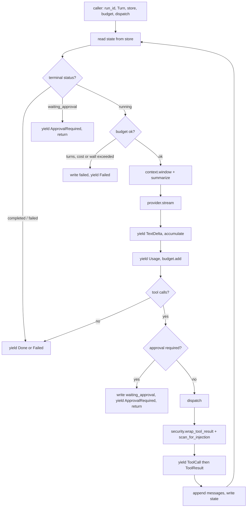
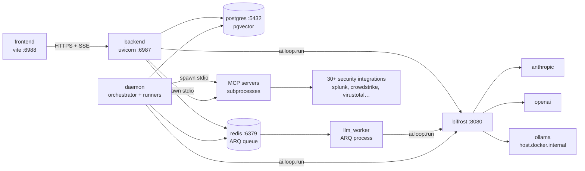
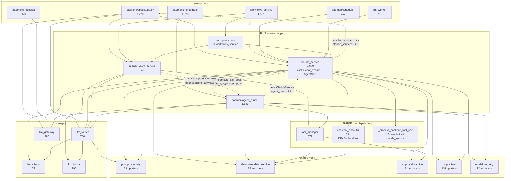
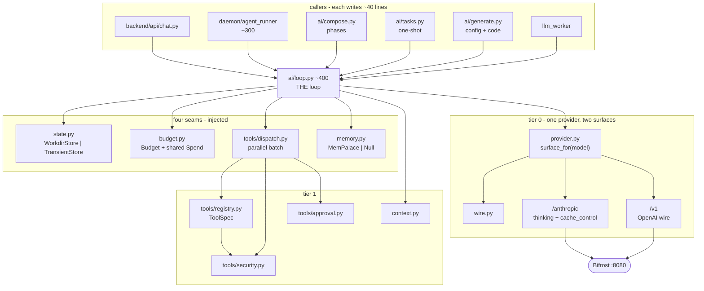
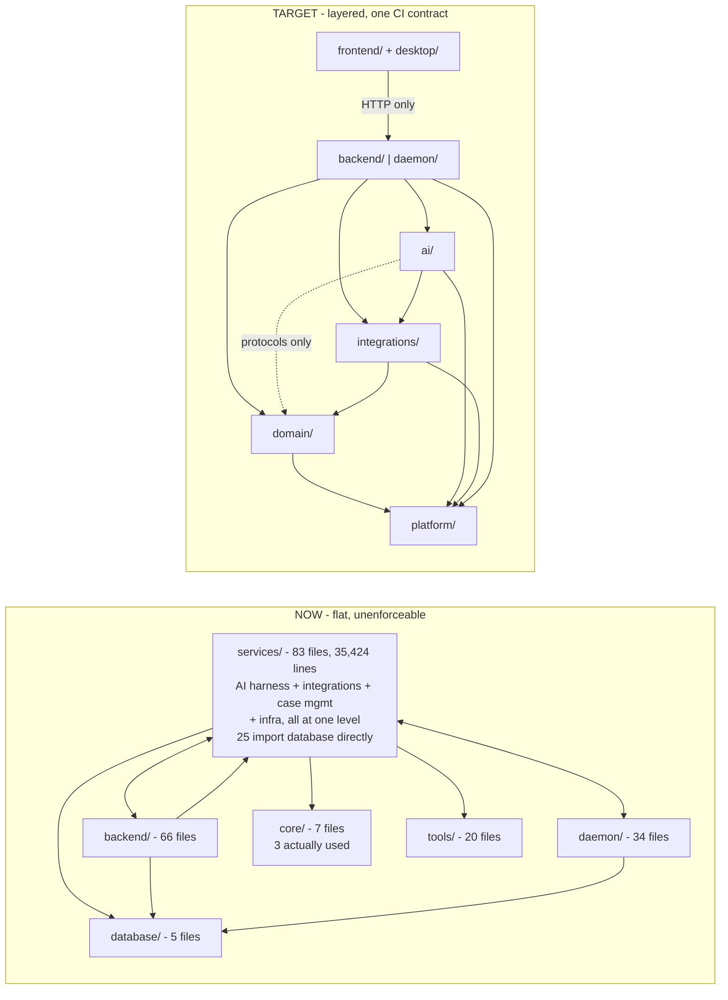

# Vigil Re-architecture — AI Harness and Platform Layering

**Status:** proposal
**Baseline:** `origin/chore/cut-legacy-ui` (78,749 lines production Python)
**Scope:** the AI harness (Part I) and the repository layering around it (Part II)

Decisions from design review that shape everything below:

- **Bifrost is always present.** Every LLM call goes through it. There is no direct-to-provider path anywhere in the target design.
- **Bifrost exposes two surfaces, and both are used.** `/anthropic` is a passthrough that preserves extended thinking and `cache_control`; `/v1` is the OpenAI format used for OpenAI, Ollama and local models. `llm_clients.py:59` constructs the Anthropic SDK with `base_url=_bifrost_anthropic_base_url()` — the SDK is a wire client for Bifrost, not a provider connection. `scripts/bifrost_capability_probe.py` is the merge-blocking verification of this.
- **Extended thinking and prompt caching are kept.** An earlier draft of this document proposed dropping them on the belief that Bifrost forced the OpenAI wire and lost both. That was wrong: the `/anthropic` surface preserves them, `ANTHROPIC_PROMPT_CACHE_ENABLED` (GH #84 PR-C) is the existing kill-switch, and `claude_service.py:2139` already restructures messages for a cacheable prefix. Cached prefixes cost ~10% of normal input tokens, so this is a material cost lever, not a nicety.
- **Caching is Anthropic's, and placing it is Vigil's job.** No Bifrost cache is configured: `docker/bifrost/config.json` has only `$schema`, `client`, `logs_store`, `providers`, and `scripts/bifrost_cache_status.py:1-18` records that Bifrost v1.4.23's cache is `semantic_cache` (vector store + embedding provider, UI-configured) and that the `cache` block was **rejected**. The single active layer is Anthropic native prompt caching over the `/anthropic` passthrough — Bifrost forwards `cache_control`, it does not insert it. Breakpoint placement is `ai/wire.py`'s responsibility, and a byte-stable prefix is what makes it pay. See [Prefix stability](#prefix-stability-is-a-loop-invariant).

One decision made here rather than deferred: **the Claude Agent SDK path is removed.** It is a second harness with its own tool wiring, and it cannot participate in the loop's budget, approval or memory seams.

A third decision was made here rather than deferred: **the Claude Agent SDK path is removed.** It is Anthropic-direct, bypasses Bifrost entirely, and cannot be reconciled with either decision above. Six call sites are repointed.

---


## Table of contents

- [Part I — The](#part-i--the-ai-package) `ai/` [package](#part-i--the-ai-package)
  - [Current state](#current-state)
  - [Design rules](#design-rules)
  - [Mechanism, policy, composition](#mechanism-policy-composition)
  - [Module map](#module-map)
  - [File tree](#file-tree)
  - [Core types](#core-types)
  - [Turn lifecycle](#turn-lifecycle)
  - [The four seams](#the-four-seams)
  - [Tool calling](#tool-calling)
  - [What disappears](#what-disappears)
  - [Where](#where-claude_servicepy-goes) `claude_service.py` [goes](#where-claude_servicepy-goes)
  - [The daemon afterwards](#the-daemon-afterwards)
  - [Every caller, after](#every-caller-after)
- [Part II — The repository](#part-ii--the-repository)
  - [Layer stack](#layer-stack)
  - [Corrections to the original sketch](#corrections-to-the-original-sketch)
  - [Repository tree](#repository-tree)
  - [Import rules](#import-rules)
  - [Process topology](#process-topology)
- [Part III — Migration plan](#part-iii--migration-plan)
- [Open questions](#open-questions)
- [Part IV — Where Vigil is, and where it should be](#part-iv--where-vigil-is-and-where-it-should-be)
  - [Topology: the AI subsystem as it is](#topology-the-ai-subsystem-as-it-is)
  - [Topology: the AI subsystem as it should be](#topology-the-ai-subsystem-as-it-should-be)
  - [Topology: repository, now versus target](#topology-repository-now-versus-target)
  - [Current state](#current-state-1)
  - [Target state](#target-state)
  - [Side by side](#side-by-side)

---


# Part I — The `ai/` package


## Current state

Roughly 14,500 lines of loop, provider and tool-execution code, excluding MCP subprocess management and daemon pollers:


| File                               | Lines |
| ---------------------------------- | ----- |
| `services/claude_service.py`       | 3,670 |
| `daemon/agent_runner.py`           | 1,643 |
| `services/workflows_service.py`    | 1,321 |
| `services/chat/*`                  | 1,122 |
| `services/openai_agent_service.py` | 842   |
| `services/llm_router.py`           | 750   |
| `services/soc_agents.py`           | 733   |
| `services/llm_worker.py`           | 705   |
| `services/tool_manager.py`         | 571   |
| `services/llm_gateway.py`          | 385   |
| `services/llm_format.py`           | 196   |
| `services/llm_clients.py`          | 74    |


### Five agentic loops

1. `claude_service.chat()` — `2030-2575`, 546 lines, synchronous
2. `claude_service.chat_stream()` — `2672-3086`, 415 lines, streaming
3. `claude_service.agent_query()` / `run_agent_task()` — `3385-3652`, Claude Agent SDK
4. `agent_runner._run_agent()` + `_call_claude()` — `369` and `880`, nested
5. `openai_agent_service.process()` — `217`
6. `workflows_service._run_phase_loop()` — `829`

`llm_router` is transport, not a loop. `chat/tool_executor.py` looks like a loop but is dead.

### Four unrelated iteration caps


| Location                     | Value | Kind                             |
| ---------------------------- | ----- | -------------------------------- |
| `claude_service.py:2816`     | 30    | hardcoded                        |
| `openai_agent_service.py:19` | 30    | module constant                  |
| `daemon/config.py:90`        | 50    | configurable                     |
| `agent_runner.py:924`        | 25    | inline, **nested inside the 50** |


The nesting means the daemon's effective ceiling is 1,250 model calls per investigation.

### Three copies of backend tool dispatch


| Location                                                       | Status                                                                   |
| -------------------------------------------------------------- | ------------------------------------------------------------------------ |
| `services/tool_manager.py:278` + `:350` + `:500` + `:543`      | live — `openai_agent_service` uses it                                    |
| `services/chat/tool_executor.py:30` + `:298` + `:469` + `:510` | **dead** — zero callers                                                  |
| `services/claude_service.py:1452-1887`                         | live — 435-line inline reimplementation, this is what the chat path runs |


### The abandoned extraction

`services/chat/` contains working `ContextManager`, `SessionManager` and `ToolExecutor`. `ContextManager` and `SessionManager` are used correctly. `ToolExecutor` is instantiated at `claude_service.py:140`, has `.skill_tool_index` assigned at `:421`, and is then never called — all three of its `process_*_tool_use` methods have zero callers repo-wide. `claude_service.py:1333-1450` is ~118 lines of forwarders self-labeled `# Back-compat class attributes — delegated to ContextManager`.

### The vestigial router

`llm_router.select_path` returns `"bifrost"` unconditionally, discards both arguments, and `DispatchPath = Literal["bifrost"]`. The real routing decision migrated inline to `dispatch():319`, which branches on `provider.provider_type == "anthropic"`. So the function that appears to decide routing decides nothing, while the actual decision is buried in a caller.

---


## Design rules

1. **One loop.** Every agentic execution — chat, daemon investigation, workflow phase, one-shot analysis — is a call to `ai.loop.run`. Adding a harness means adding a caller, never a loop.
2. **One provider.** `ai/provider.py` speaks Bifrost's OpenAI-compatible wire and nothing else. No `Provider` protocol: an interface with one implementation is what you delete, not what you build.
3. **Streaming is the only mode.** The loop yields events; callers that don't want a stream drain the iterator. This is what removes `chat()` and `chat_stream()` as separate code paths.
4. **Three seams, injected.** `TurnStore`, `dispatch`, `Budget`. Each has more than one real implementation, which is why each earns being a seam.
5. **The loop owns no domain knowledge.** No findings, no cases, no investigations. Those arrive as prompts and tool schemas.
6. `loop.py` **imports no agent; agents import no loop internals.** Policy is data plus a three-method protocol. If changing an agent requires editing `loop.py`, the extension point is in the wrong place.

---


## Mechanism, policy, composition

"One loop" is necessary but not sufficient. If the only thing an agent can vary is `(system_prompt, tool_subset, model)`, that is a **persona**, and personas do not capture how agents actually differ.

Triage is a two-turn classifier that must emit a typed verdict. Responder is plan-then-approve-then-execute with serialized `ACTION` tools. Those are different control flows, not different prose. With persona as the only pluggability, the first agent needing different control flow gets it the way the last five did — by adding a loop. That is the failure this document exists to prevent, and the design in the sections above does not yet prevent it.

Three planes, and rule 6 is what keeps them apart:


| Plane           | Varies per agent?  | Lives in                           | Contents                                                                                        |
| --------------- | ------------------ | ---------------------------------- | ----------------------------------------------------------------------------------------------- |
| **Mechanism**   | never              | `loop.py`, `provider.py`, `tools/` | turn iteration, budget, dispatch, retry, timeout, truncation, security wrapping, approval pause |
| **Policy**      | yes, declaratively | `AgentSpec`, `policy.py`           | tools, model, stop condition, output contract, working-state shape                              |
| **Composition** | yes                | `compose.py`                       | which agents run, in what order, under what condition                                           |


### `AgentSpec`

```python
@dataclass(frozen=True)
class AgentSpec:
    id: str
    system: str | Callable[[RunCtx], str]
    tools: ToolFilter                    # namespaces + tiers + allow/deny
    model: str
    budget: Budget
    stop: StopPolicy
    output: OutputContract
    working_state: WorkingStateSpec | None = None
    policy: Policy | None = None         # escape hatch; ~12 of 14 omit it
```

`ai/agents.py` (890 lines of `AGENT_CONFIGS`) becomes `ai/agents/` — one file per agent, auto-discovered, plus DB-backed custom agents through the `AgentStore` seam. Adding an agent is adding a file. That is the literal form of "pluggable."

Of the 14 built-ins in `AGENT_CONFIGS:176`, only Responder and a hunt-style agent need a `policy`. The rest are declarative fields only.

**A** `Policy` **is a pure function.** No I/O, no provider access, no store writes — `(ctx, results) → Directive`. A policy that can call the provider is a loop with extra steps, which is exactly how the current five happened.

```python
class Policy(Protocol):
    def on_results(self, ctx: RunCtx, results: list[ToolResult]) -> Directive: ...
    def finalize(self, ctx: RunCtx) -> Artifact: ...

Directive = Continue | Stop(reason) | Inject(blocks)
```

Two hooks, not three. Turn-suffix rendering belongs to `WorkingStateSpec.render` (below) — every proposed use of a separate `turn_suffix` hook was rendering working state, so it does not clear the two-distinct-implementations bar. Contract repair is mechanism in `loop.py`, not a `Directive` variant; one bounded path, not two.

`Inject` and `render` can only **append to the tail** of the message list. That makes [prefix stability](#prefix-stability-is-a-loop-invariant) a type-level guarantee rather than a documented rule someone violates in six months.

### Control tools

Some tools are addressed to the loop, not the world. **Two already exist**, hardcoded in the daemon: `agent_runner._execute_tool:1076` intercepts `update_plan_step` and `signal_complete` in an if/elif chain before falling through to `_execute_external_tool`, alongside the four `*_investigation_file` workdir tools. The interception mechanism is real; it is just trapped in one runner.

`ai/control.py` generalizes the family:

```
plan_set(steps)                  plan_update(step_id, status)
note(kind, text, cites)          # hypothesis | evidence | assumption
signal_complete(artifact)        # validated against the output contract
request_approval(...)            delegate(agent_id, task)
```

These execute in-loop — no dispatch, no network — and are always `parallel_safe=False` because they mutate run state.

### `WorkingState`

This is the highest-value item here, and it fixes a flaw in the design above rather than adding a feature.

`context.py` folds the middle of the history. On turn 30 of a 50-turn investigation the model cannot see what it concluded on turn 8, so it re-fetches the finding. The [per-run result cache](#per-run-result-cache) I proposed treats that symptom; the disease is that there is no durable scratchpad. The cache stays as a cheap optimization, but it is no longer the answer.

```python
@dataclass
class WorkingState:
    plan: list[PlanStep]
    hypotheses: list[Note]
    evidence: list[Evidence]           # {claim, tool_result_id}
    entities: dict[str, list[str]]     # ips, domains, hashes
    ruled_out: list[str]
```

Lives in `TurnStore`, rendered deterministically into the turn tail every turn by `WorkingStateSpec.render`. Five consequences, four of them specific to SOC work:

1. **Provenance.** Every claim carries a `tool_result_id`. Reporter renders citations; a reviewer traces any sentence in a report back to the tool call that produced it. That is an audit property that cannot be retrofitted later.
2. `entities` **is the free input** to `Memory.persist` and `Memory.recall`, instead of `_fetch_prior_palace_context:890` re-deriving it from the finding.
3. **A real novelty signal for stop policies.** "No new entity or evidence in three turns" is a far better convergence test than a `frozenset` of call signatures.
4. **Correct resume.** Today resume replays messages. Restoring working state restores *understanding* — which is what makes terminate-and-resume viable for chat approvals, and resolves [open question 1](#1-approval-in-chat--resolved-terminate-and-resume).
5. **Readable mid-run.** Supervision currently logs `iteration_count` and a free-text `current_activity` (`orchestrator.py:504-509`) — a turn counter and a string. Structured state is something a human or a review agent can actually assess.


### `StopPolicy`

```python
StopPolicy = ModelStops                       # default ReAct
           | ToolSignalled("signal_complete")
           | SchemaSatisfied(schema)
           | Converged(window=3, metric=novelty)
           | Repetition(window=5, k=3)
           | AnyOf(...) | AllOf(...)
```

`Repetition` and the budget ceilings are **implicit for every agent**. That is the correct fix for "repetition detection exists in one of five loops" — not porting `_detect_infinite_loop:535` into one place, but making it unconditional.

Triage is `AnyOf(ToolSignalled, MaxTurns(2))`. Investigator is `AnyOf(ModelStops, Converged, budget)`.

### `OutputContract`

`Done(summary: str)` is too weak. `autonomous_response_service` takes `severity: str` and reads `action_data.get("title")`, `.get("target", "unknown")` — a consumer that wants structure and receives whatever the caller assembled. Nothing can reliably branch on prose.

```python
@dataclass
class Artifact:
    schema_id: str
    data: dict                       # validated
    citations: list[ToolResultId]
    confidence: float | None
```

On validation failure: one repair turn, feeding the validator error back as a tool result, then `Failed`. Bounded and cheap, and it is the whole difference between a triage agent you can automate on and one you cannot.

### On ReAct specifically

Classic ReAct's `Thought:` / `Action:` / `Observation:` text protocol is obsolete here and must not be reimplemented. Native tool calls are the Action; extended thinking on the `/anthropic` surface is the Thought — both structured, both already preserved.

What is worth keeping is observation-conditioned iteration (already present) and an explicit reasoning trace (present but ephemeral). The `note` control tool is the durable version, and that is the actual upgrade.

Two things worth adding past ReAct:

- **Plan-then-act for** `ACTION` **agents.** Responder should never freewheel. `plan_set` → approval on the whole plan → serialized execution is a distinct regime, and it is what stops a model isolating two hosts because it changed its mind mid-run. Serialized `ACTION` dispatch is necessary but not sufficient; plan-level approval is the rest.
- **Reflexion-lite.** On `Converged` or `Failed`, one retrospective turn writing to working state before `Memory.persist`. Cheap, and it is what makes the next investigation of the same entity better rather than identical.


### Explicitly not building

Policy classes for the ~12 agents that differ only by prompt and tools. A general DAG engine. An LLM router. Parallel phases before a flow declares one. Delegation.

---


## Module map

Tiers are dependency order. A module may import from any tier above it, never below.

### Tier 0 — wire and accounting (no internal dependencies)


| Module        | Lines | Owns                                                                                                                                                      | Provenance                                                                                 |
| ------------- | ----- | --------------------------------------------------------------------------------------------------------------------------------------------------------- | ------------------------------------------------------------------------------------------ |
| `provider.py` | ~380  | Both Bifrost surfaces. Picks `/anthropic` (thinking, `cache_control`) or `/v1` (OpenAI format) by model, streams a uniform `Delta`, normalizes tool calls | `llm_router` `_dispatch_bifrost_openai:346` + `_dispatch_anthropic:522` + `llm_clients.py` |
| `wire.py`     | ~200  | The two message shapes and the translation between them; one-time tool-schema conversion                                                                  | `llm_format` + `claude_service:943-1183, 2576-2671`                                        |
| `models.py`   | ~80   | Provider specs, model list, cost rate table — data, not logic                                                                                             | `llm_router:615-750`, `model_registry:465`                                                 |
| `budget.py`   | ~80   | One cost function, turn/cost/wall ceilings, shared `Spend` accumulator                                                                                    | new; replaces 5 implementations                                                            |
| `state.py`    | ~190  | `TurnStore` protocol + `WorkdirStore` + `TransientStore`, plus `WorkingState` and its deterministic renderer                                              | new; wraps `daemon/workdir.py`                                                             |
| `memory.py`   | ~120  | `Memory` protocol + `MemPalaceMemory` + `NullMemory`. Cross-run recall and persist                                                                        | consolidates `orchestrator:834-926`, `shared_intel.py`                                     |


### Tier 1 — tools (imports tier 0)


| Module              | Lines | Owns                                                                                                                              | Provenance                           |
| ------------------- | ----- | --------------------------------------------------------------------------------------------------------------------------------- | ------------------------------------ |
| `tools/registry.py` | ~220  | Union of backend, skill and MCP tool schemas; converts to OpenAI functions once at load                                           | `claude_service:382-426, 712-885`    |
| `tools/dispatch.py` | ~570  | The only tool executor: name→callable, tiering, response truncation                                                               | `tool_manager.py`, essentially as-is |
| `tools/approval.py` | ~150  | Action-tool gate. Raises the requirement; does not wait                                                                           | `agent_runner:1359, 1423, 1530`      |
| `tools/security.py` | ~260  | **Trust boundary.** `scan_for_injection`, `wrap_tool_result`, `scan_tool_schema`, `has_disallowed_control_chars`                  | `prompt_security.py`, unchanged      |
| `control.py`        | ~180  | Loop-addressed tools: `plan_set`, `plan_update`, `note`, `signal_complete`, `request_approval`. Execute in-loop, never dispatched | generalizes `agent_runner:1076-1196` |
| `policy.py`         | ~280  | `AgentSpec`, `Policy`, `Directive`, `StopPolicy` combinators, `OutputContract`, `Artifact` validation                             | new                                  |
| `context.py`        | ~380  | History windowing, overflow summarization, tool-response budgets                                                                  | `chat/context_manager.py`, as-is     |


### Tier 2 — the loop (imports tiers 0–1)


| Module    | Lines | Owns                                                                                                 | Provenance                                |
| --------- | ----- | ---------------------------------------------------------------------------------------------------- | ----------------------------------------- |
| `loop.py` | ~400  | Turn iteration, budget enforcement, tool dispatch, approval pause/resume, event emission, OTel spans | ported from `agent_runner._run_agent:369` |


### Tier 3 — content and composition (imports tiers 0–2)


| Module               | Lines  | Owns                                                                                                                                                                      | Provenance                                                                                         |
| -------------------- | ------ | ------------------------------------------------------------------------------------------------------------------------------------------------------------------------- | -------------------------------------------------------------------------------------------------- |
| `agents/`            | ~1,100 | Package, one `AgentSpec` per file, auto-discovered. 14 built-ins + the default system prompt + DB-backed custom agents via `AgentStore`. Adding an agent is adding a file | `soc_agents.AGENT_CONFIGS:176` + `claude_service:164-324`                                          |
| `generate.py`        | ~900   | One-shot generation: agent profiles, `WORKFLOW.md` bodies, MCP integration code, case insights. No tools, no multi-turn                                                   | `agent_ai_generator`, `workflow_ai_generator`, `custom_integration_service`, `ai_insights_service` |
| `skills.py`          | ~900   | Skill loading, import, prompt injection                                                                                                                                   | `skill_service`, `skill_importer`, `skill_tools_bridge`                                            |
| `tasks.py`           | ~150   | `analyze_finding`, `correlate_findings`, `summarize_case`, `analyze_event` — one-shot loop calls                                                                          | `claude_service:3087-3384`                                                                         |
| `workflows.py`       | ~650   | `WORKFLOW.md` parsing. Contains zero LLM code                                                                                                                             | `workflows_service.py` minus its execution half                                                    |
| `compose.py`         | ~330   | Flow executor: sequence, conditional, parallel group. Three primitives, no DAG engine                                                                                     | `workflows_service._run_phase_loop:829`                                                            |
| `personalization.py` | ~60    | Org profile merged into prompt templates                                                                                                                                  | **deferred** — build when a caller reads it                                                        |


**Total: ~6,700 lines** — see the [file tree](#file-tree) for the breakdown.

### Deliberately outside `ai/`


| Module            | Lines | Why                                                           |
| ----------------- | ----- | ------------------------------------------------------------- |
| `mcp_service.py`  | 631   | Subprocess lifecycle, not AI                                  |
| `mcp_client.py`   | 660   | MCP session management                                        |
| `mcp_registry.py` | 209   | Live server and tool inventory                                |
| `llm_gateway.py`  | 385   | ARQ queue client                                              |
| `llm_worker.py`   | ~350  | ARQ worker; keeps queue and rate limiting, loses its own loop |


---


## File tree

```
ai/
├── __init__.py                  run(), Budget, Turn, TurnStore re-exports
├── loop.py                      ~400   the one agentic loop            NEW
├── provider.py                  ~250   Bifrost OpenAI wire             NEW
├── wire.py                      ~90    message + schema translation    NEW
├── models.py                    ~80    provider specs, rate table      MOVED
├── budget.py                    ~80    the only cost path              NEW
├── state.py                     ~90    TurnStore + 2 impls             NEW
├── memory.py                    ~120   cross-run recall + persist      NEW
├── context.py                   ~380   windowing, summarization        MOVED
├── compose.py                   ~180   phase chaining + delegation     NEW
├── policy.py                    ~280   AgentSpec, StopPolicy, Artifact  NEW
├── control.py                   ~180   loop-addressed tools             NEW
├── skills.py                    ~900   skill load + injection          MOVED
├── tasks.py                     ~150   one-shot analysis helpers       NEW
├── generate.py                  ~900   agent/workflow/integration gen  MOVED
├── workflows.py                 ~650   WORKFLOW.md parsing, no LLM     MOVED
├── compose.py                   ~330   flow executor, 3 primitives     NEW
├── personalization.py           ~60    deferred until a caller exists
├── protocols.py                 ~70    the 5 domain seams              NEW
├── agents/                      ~1,100 one AgentSpec per file          NEW
│   ├── __init__.py                     registry + auto-discovery
│   ├── _base.py                        shared prompt scaffold
│   ├── triage.py                       AnyOf(ToolSignalled, MaxTurns(2))
│   ├── investigator.py                 AnyOf(ModelStops, Converged)
│   ├── responder.py                    plan-then-approve policy
│   ├── correlator.py  mitre_analyst.py  reporter.py
│   ├── threat_hunter.py  forensics.py  threat_intel.py
│   ├── compliance.py  malware_analyst.py  network_analyst.py
│   └── auto_responder.py
├── tools/
│   ├── registry.py              ~220   ToolSpec union, load-time conv  MOVED
│   ├── dispatch.py              ~570   parallel batch executor         MOVED
│   ├── approval.py              ~150   action gate                     MOVED
│   └── security.py              ~260   injection scan, result wrapping MOVED
└── tests/
    ├── test_loop.py             budget exhaustion, approval resume,
    │                            tool errors, shutdown mid-turn
    ├── test_provider.py         wire round-trip, tool-call normalize
    ├── test_budget.py           rate table, ceiling arithmetic, Spend
    ├── test_memory.py           recall byte-parity with the daemon
    ├── test_registry.py         name collisions, schema conversion
    ├── test_security.py         injection corpus, wrapper escaping
    ├── test_dispatch.py         parallel batch, ACTION serialization,
    │                            ordered reassembly, per-spec timeout
    ├── test_policy.py           StopPolicy combinators, contract repair
    ├── test_working_state.py    render determinism, provenance, resume
    ├── test_compose.py          conditional, parallel group, resume at node
    ├── test_context.py
    └── fakes.py                 FakeProvider, TransientStore, fake stores
```

**Total: ~6,700 lines** — about 1,440 over the persona-only design, not the ~700 first estimated. The extra is provenance plumbing, resume-from-state, contract validation, flow conditionals and 14 agent files.

Every piece replaces something currently hardcoded in one loop: `StopPolicy` replaces four iteration caps plus one repetition detector, `control.py` replaces the if/elif chain at `agent_runner:1076`, `compose.py` replaces `_run_phase_loop:829`. `WorkingState` replaces nothing — it is the one genuine addition, and it is the one that pays for the rest.

### `ai/generate.py` — the second AI pattern

Four services generate content rather than investigate, and none of them appeared in the first draft:


| Source                                    | Lines | Produces                                                     |
| ----------------------------------------- | ----- | ------------------------------------------------------------ |
| `agent_ai_generator.py`                   | 315   | an agent profile from a description                          |
| `workflow_ai_generator.py`                | 258   | a `WORKFLOW.md` body                                         |
| `custom_integration_service.py`           | 665   | **executable Python MCP server code** from API documentation |
| `backend/services/ai_insights_service.py` | 472   | case insights (already on `llm_gateway`)                     |


These are one-shot, tool-free, single-turn calls whose output is configuration or code. They do **not** need the agentic loop — they need `provider.stream` and a prompt. Putting them behind `ai.loop.run` with an empty tool list and `max_turns=1` works and keeps one code path; that is the recommendation.

`custom_integration_service` warrants a note: it has an LLM author Python that then runs as an MCP subprocess. That is a code-execution surface driven by model output, and it stays gated by whatever review exists today. This refactor must not quietly relax it.

---


## Core types

This is the entire public surface of the harness.

```python
# ai/budget.py

@dataclass
class Spend:
    """Shared accumulator. One instance per top-level run, referenced by
    every nested Budget so a delegated child debits its parent."""
    cost_usd: float = 0.0
    input_tokens: int = 0
    output_tokens: int = 0

@dataclass
class Budget:
    max_turns: int = 30
    max_cost_usd: float = 5.0
    max_wall_s: float = 300.0
    max_depth: int = 2                       # delegation recursion guard
    spend: Spend = field(default_factory=Spend)

    def child(self, *, max_turns: int) -> "Budget":
        """Budget for a delegated sub-agent. Shares the parent's Spend, so
        the parent's cost ceiling bounds the whole tree."""
        return replace(self, max_turns=max_turns,
                       max_depth=self.max_depth - 1, spend=self.spend)


# ai/loop.py

@dataclass
class Turn:
    messages: list[dict]      # OpenAI wire, canonical
    tools: list[dict]         # OpenAI function shape
    system: str
    model: str

class TurnStore(Protocol):
    """This run's state. Scoped to one run, discarded or archived after."""
    def read_state(self, run_id: str) -> dict: ...
    def write_state(self, run_id: str, state: dict) -> None: ...
    def append_log(self, run_id: str, event: dict) -> None: ...

class Memory(Protocol):
    """Knowledge that outlives the run. Entity-keyed, cross-run."""
    async def recall(self, entities: dict[str, list[str]]) -> str: ...
    async def persist(self, run_id: str, summary: str,
                      entities: dict[str, list[str]]) -> None: ...

@dataclass
class Done:
    state: dict
    artifact: Artifact | None        # typed, validated, with citations

Event = TextDelta | ToolCall | ToolResult | ApprovalRequired | Usage | Done | Failed

async def run(
    run_id: str,
    turn: Turn,
    spec: AgentSpec,                 # policy plane: stop, output, tools, working state
    *,
    store: TurnStore,
    budget: Budget,
    dispatch: Callable[[str, dict], Awaitable[str]],
    memory: Memory = NullMemory(),
) -> AsyncIterator[Event]: ...
```

`spec` is the whole policy plane. Per rule 6, `loop.py` reads `spec.stop`, `spec.output`, `spec.working_state` and optionally calls `spec.policy.on_results` — but it never imports a concrete agent, and no agent module imports anything from inside `loop.py`.

A new harness supplies a `Turn`, a store, a budget and a dispatch function, then consumes events. Nothing about findings, cases or investigations appears in the signature.

`TurnStore` and `Memory` are deliberately separate. `TurnStore` holds *this run's* messages and status; `Memory` holds what should still be true in three weeks. Conflating them is what produced the current situation where the daemon has both and nothing else has either.

### Canonical format: Anthropic blocks

The canonical internal shape is **Anthropic content blocks**, and `wire.py` translates outward to the OpenAI format for the `/v1` surface. Three reasons:

1. Backend, skill and MCP tools are all *already* authored Anthropic-shaped (`{name, description, input_schema}`), so the `/anthropic` surface needs no schema conversion at all.
2. `llm_format.anthropic_tools_to_openai` and `anthropic_messages_to_openai` already exist and translate in exactly this direction.
3. Thinking blocks and `cache_control` markers have no OpenAI representation. Canonicalising on OpenAI would mean lossy round-trips on the surface that carries Vigil's most expensive traffic.

Schema conversion for the `/v1` surface happens **once at registry load**, not per call.

### Surface selection

```python
# ai/provider.py
def surface_for(model: str) -> Surface:
    """Anthropic models take the passthrough; everything else the OpenAI wire."""
    return Surface.ANTHROPIC if is_anthropic_model(model) else Surface.OPENAI
```

This is the *only* place in the target design that branches on model family. Today that branch is duplicated across six files as `provider_type == "anthropic"` checks, which is what makes adding a model family expensive.

**Ollama is not a fourth loop or a third surface — it is the third** `provider_type` **value on the existing** `/v1` **branch.** `docker/bifrost/config.json:60` registers it as a Bifrost provider like any other; being OpenAI-wire-compatible, it takes the same path as OpenAI in `surface_for`. What actually differs for Ollama, and stays outside `ai/` entirely:

- **Cost is hardcoded** `$0`, not looked up (`model_registry.py:266,292`) — feeds `ai/budget.py`'s rate table as a fixed zero-cost row, no special-casing in the loop.
- **The Bifrost allow-list is a wildcard** (`bifrost_admin.py:172`, `["*"]`) instead of a finite model list, since self-hosted models are whatever the user pulled.
- **Tool-calling support is inferred heuristically** (name/family matching, `OLLAMA_EXTRA_TOOL_MODELS` env override — `provider_model_discovery.py:339-463`) rather than read from an API. This determines whether `registry.subset()` offers tools to that model at all; it is a registry-time filter, not a loop-time branch.
- **Process supervision is out-of-band.** `ollama_process.py` (host-native supervisor, since containerized Ollama on macOS loses Metal passthrough) and `local_ai_recovery.py` (dev-only Bifrost restart) both belong in `platform/` — they manage whether Ollama is reachable, never how a call to it is shaped.

None of this touches `loop.py`, `wire.py`, or `surface_for`. Adding a fourth self-hosted backend (vLLM, LM Studio) is the same shape: a Bifrost provider entry plus a cost/capability row, not a new code path.

`Delta` carries a `thinking` variant that only the `/anthropic` surface emits; consumers ignore unknown variants. That is one wart, in one file, and it buys extended thinking on the daemon's long investigation runs.

---


## Turn lifecycle




`ai/tools/security.py` sits on the return path of every tool call and is not optional. `prompt_security.wrap_tool_result:173` delimits and escapes third-party content before it re-enters the message list; `scan_for_injection:117` flags known patterns; `scan_tool_schema:214` checks schemas at registry load, since an MCP server's own tool descriptions are untrusted text. This is a trust boundary — it does not get simplified away, and the loop is the only correct place for it because every caller must get it.

### Why approval is an event, not a branch

The daemon pauses for minutes and resumes from disk. Chat pauses for seconds on an open SSE connection. Making the pause a yielded event plus a state write means one mechanism serves both: the caller decides whether to hold the connection or terminate and resume on a new request.

Today this logic exists only in `agent_runner._check_approval:1423` and no other loop can reach it.

---


## The four seams


| Seam        | Implementations                                                          | Used by                         | Why it earns being a seam                                                                              |
| ----------- | ------------------------------------------------------------------------ | ------------------------------- | ------------------------------------------------------------------------------------------------------ |
| `TurnStore` | `WorkdirStore`, `TransientStore`                                         | daemon / chat + one-shot        | Durable file-backed state versus ephemeral in-memory. Genuinely different lifetimes — do not unify.    |
| `dispatch`  | backend tools, MCP tools, workdir tools, delegation tool, recording fake | all callers                     | The daemon exposes workdir tools chat must never see. A callable keeps that decision at the call site. |
| `Budget`    | per-investigation, per-chat-turn, per-workflow-phase, per-delegation     | all callers                     | Replaces the four unrelated caps; carries the shared `Spend` that bounds a delegation tree.            |
| `Memory`    | `MemPalaceMemory`, `NullMemory`                                          | daemon today, all callers after | Cross-run recall is currently daemon-only and reached two different ways. See below.                   |


Deliberately **not** seams: the provider (one implementation), the wire format (one), the tool registry (one), the prompt store (one). Each would be an interface with a single implementation.

---


## Tool calling

This is where the product demands sit. A SOC agent's turn is mostly tool calls, and the current implementation is the least sophisticated part of the harness.

### What is wrong today

**Tool calls run strictly sequentially, even when the model asks for them in parallel.** There is no `asyncio.gather` in any loop in the repo — not `claude_service`, not `openai_agent_service`, not `agent_runner`, not `chat/tool_executor`. Both wire formats emit multiple tool calls per assistant turn, and `claude_service.py:2021-2025` walks them one at a time:

```python
for item in content:
    if is_backend(item):  result = await self._process_backend_tool_use([item])
    else:                 result = await self._process_tool_use([item])
```

An enrichment fan-out — one IOC across VirusTotal, Shodan, OTX, MISP and AlienVault — is five sequential round trips to five unrelated external services. At a 2–5s median each that is 10–25s of wall clock for work that should cost the slowest single lookup. This is the single largest latency win available in the harness, and it needs no model changes.

**Repetition detection exists in exactly one loop, and it is the loop being deleted.** `openai_agent_service` builds `frozenset` call signatures (`:389`), keeps a `deque(maxlen=5)` (`:215`) and stops on three identical repeats (`_detect_infinite_loop:535`, `_LOOP_DETECT_THRESHOLD=3`). `claude_service` and `agent_runner` have nothing — an agent stuck re-calling the same tool burns the full 30 or 50 turns. Deleting `openai_agent_service` without porting this is a regression.

**Tool identity is string surgery, in four places, with inconsistent rules.** `agent_runner:912` does `split("_", 1)[-1]` to strip a prefix; `agent_runner:1308` does `split("_", 1)` to *recover* a server name; `claude_service:1907` does its own `split("_", 1)`; `claude_service:765-775` builds the prefixed names in the first place. A server whose name contains an underscore breaks all of them. Collisions resolve by a comment at `claude_service:1993` — backend wins because it is checked first.

**Timeouts and response ceilings live as module constants in the file being deleted.** `_TOOL_TIMEOUT_S = 30`, `_MAX_TOOL_RESPONSE_CHARS = 50_000` (`openai_agent_service:20-21`). Meanwhile per-tool token budgets live somewhere else entirely, in `ContextManager.TOOL_RESPONSE_BUDGETS:81`. Two mechanisms, two files, no single record of what a tool costs.

### `ToolSpec` — one record per tool

Everything above is a symptom of there being no single description of a tool. `ai/tools/registry.py` produces one:

```python
@dataclass(frozen=True)
class ToolId:
    namespace: str          # "backend" | "skill" | "workdir" | <mcp server name>
    name: str
    def __str__(self) -> str: return f"{self.namespace}/{self.name}"

@dataclass(frozen=True)
class ToolSpec:
    id: ToolId
    schema: dict                    # Anthropic shape, canonical
    tier: Tier                      # READ | WRITE | ACTION
    timeout_s: float = 30.0
    response_budget_tokens: int = 12_000
    parallel_safe: bool = True      # False for ACTION and stateful WRITE
    idempotent: bool = False        # eligible for the per-run result cache
```

`ToolId` being a pair rather than a delimited string retires all four `split("_", 1)` sites and makes collisions structurally impossible instead of resolved-by-ordering. The wire name stays `namespace_name` for model-facing purposes; the registry keeps the mapping, so nothing parses it back.

`tier` comes from the existing logic — `tool_manager.get_tool_tier:212`, `_has_action_verb:188`, `_UNGATED_PREFIXES:209` (`mempalace_`, `skill_`), and the `_TOOL_TIER_LOOKUP` table — with its current fallback preserved: an unknown tool whose name contains an action verb is `ACTION`, therefore gated. That default is correct and does not change.

`response_budget_tokens` absorbs `ContextManager.TOOL_RESPONSE_BUDGETS:81` verbatim, including the tiering that already exists there (30,000 for `get_raw_logs` / `splunk_search` / `timesketch_search`; 12,000 for `list_findings` / `nearest_neighbors` and friends; `MAX_TOOL_RESPONSE_TOKENS = 30000` as the ceiling).

### Parallel dispatch

```python
async def dispatch_batch(calls: list[ToolCall], specs, *, limit=6) -> list[ToolResult]:
    """Parallel for parallel-safe calls, serial for the rest.
    Results return in call order regardless of completion order — tool_use_id
    ordering is part of the wire contract on both surfaces."""
    sem = asyncio.Semaphore(limit)

    async def one(call):
        spec = specs[call.id]
        async with sem:
            try:
                async with asyncio.timeout(spec.timeout_s):
                    raw = await execute(call, spec)
            except TimeoutError:
                return ToolResult(call, error=f"timed out after {spec.timeout_s}s")
        return ToolResult(call, security.wrap_tool_result(
            context.truncate(raw, spec.response_budget_tokens)))

    parallel = [c for c in calls if specs[c.id].parallel_safe]
    serial   = [c for c in calls if not specs[c.id].parallel_safe]

    done = dict(zip(parallel, await asyncio.gather(*map(one, parallel))))
    for c in serial:                      # ACTION tools never overlap
        done[c] = await one(c)
    return [done[c] for c in calls]
```

Four properties worth stating because each maps to a failure the current code either has or would acquire:

- **Ordered reassembly.** Both surfaces require tool results to correspond to their `tool_use_id`s. Completion order is not call order, so the result list is rebuilt by call order.
- `ACTION` **tools serialize.** Two concurrent host isolations or firewall changes is not a latency optimization, it is an incident. `parallel_safe=False` on `ACTION` is a correctness property, not a tuning knob.
- **Per-call timeout from the spec**, not one global constant. A `splunk_search` over 30 days and a `ip_geolocation` lookup do not deserve the same 30s.
- **Bounded concurrency.** MCP servers are subprocesses over stdio; an unbounded fan-out across 30 integrations is a local resource problem before it is a remote one.


### Turn-level guards

Ported from `openai_agent_service` and generalized so every caller gets them:


| Guard            | Source                                               | Behaviour                                                                                                                          |
| ---------------- | ---------------------------------------------------- | ---------------------------------------------------------------------------------------------------------------------------------- |
| Repetition       | `_detect_infinite_loop:535`, window 5 / threshold 3  | identical `frozenset` call signature 3× in 5 turns → inject a stop instruction, end the run cleanly rather than burning the budget |
| Timeout          | `_TOOL_TIMEOUT_S`, now per-spec                      | error string as the tool result; the model gets to react rather than the run dying                                                 |
| Response ceiling | `TOOL_RESPONSE_BUDGETS` + `_MAX_TOOL_RESPONSE_CHARS` | truncate to the spec budget, always via `context.truncate`                                                                         |
| Schema trust     | `prompt_security.scan_tool_schema:214`               | scanned at registry load — an MCP server's tool *descriptions* are third-party text in the system prompt                           |
| Result trust     | `prompt_security.wrap_tool_result:173`               | every result delimited and escaped before re-entering messages                                                                     |


### Per-run result cache

`ToolSpec.idempotent` marks read tools whose result cannot change inside one run — MITRE technique lookups, `get_finding` on a closed finding, geolocation. Keying a dict on `(ToolId, canonical_json(args))` for the run's duration makes a repeated fetch free.

**This is an optimization, not the fix for re-fetching.** An agent re-fetches a finding on turn 24 because `context.py` folded away what it learned on turn 8 — the cache makes the repeat cheap but leaves the agent amnesiac. `[WorkingState](#workingstate)` is the actual answer; this cache is the cheap complement to it.

Scoped to the run, in memory, discarded at `Done`. Deliberately *not* a cross-run cache — that is `Memory`'s job, and conflating them means serving stale enrichment as though it were fresh.

### Prefix stability is a loop invariant

Anthropic's `cache_control` matches on an **exact prefix**, and it is the only cache in the system. So: **the front of the message list must be byte-identical between turns.** `claude_service.py:2139` already notes it is restructuring messages for "a more cacheable prefix for PR-C's cache_control."

There is no hash cache and no semantic cache to fall back on. An earlier draft of this document claimed Bifrost did exact-hash caching, citing `llm_clients.py:7` ("while Bifrost layers in exact-hash caching") — that is PR-B aspiration which `bifrost_cache_status.py` explicitly supersedes: *"not the simple exact-hash cache this repo's PR-B originally planned around."* The draft also mis-cited `env.example:351`, which is inside the `SANDBOX_AUTO_SUBMIT` block and refers to **malware file-hash lookups**, not LLM caching.

That correction makes this rule *more* load-bearing, not less. With two independent caches a broken prefix degrades one of them; with one, a broken prefix means paying full price on every turn of a 50-turn investigation.

Vigil owns the breakpoints. `apply_prompt_cache_controls:176` marks the system block and the last message ephemeral; that logic moves to `ai/wire.py` and is the only place `cache_control` is inserted.

Making it an invariant rather than an incidental property:

- No timestamps, run IDs, elapsed counters or turn numbers in the system prompt or the first user message. They belong in tool results, which sit after the cache breakpoint.
- Tool schemas serialize with sorted keys and a stable order across turns.
- `Memory.recall` output is injected **once**, before turn one, and never refreshed mid-run — a recall that changes shape on turn 6 invalidates the prefix for every remaining turn.
- Context summarization rewrites the *middle* of the history. `context.py` already windows and folds; the rule is that folding never touches the prefix.

A single unstable byte in the system prompt turns a ~10%-of-input-cost prefix into full price on every turn of a 50-turn investigation. This is the highest-leverage rule in the document and it costs nothing to hold.

### What this buys


| Capability            | Today                                 | After                                          |
| --------------------- | ------------------------------------- | ---------------------------------------------- |
| Parallel tool calls   | none — sequential in all 5 loops      | bounded-concurrency batch, `ACTION` serialized |
| Repetition detection  | 1 of 5 loops, being deleted           | all callers                                    |
| Per-tool timeout      | one 30s constant, in the deleted file | per `ToolSpec`                                 |
| Tool identity         | `split("_", 1)` in 4 places           | `ToolId(namespace, name)`                      |
| Collision handling    | first-checked-wins, by comment        | structurally impossible                        |
| Idempotent re-fetch   | re-executed every time                | per-run cache                                  |
| Schema trust          | scanned in one path                   | at registry load, all paths                    |
| Prompt-cache hit rate | incidental                            | invariant                                      |


---


## Cross-run memory and the context layer

This was missing from the first draft of this document and is a genuine hole, not an omission of prose.

### Current state: one store, two access paths, one consumer

**Path 1 — as an MCP tool, available to every agent.** MemPalace is a submodule exposed as the `mempalace` MCP server, default-enabled at `mcp_service.py:260`. Agents call `mempalace_list_wings`, `mempalace_list_rooms`, `mempalace_search` and friends. `tool_manager.py:209` un-gates the `mempalace_`* prefix from approval since memory housekeeping is not a security action. `soc_agents.py:40-110` holds `_MEMORY_PALACE_BLOCK`, a prompt section injected only when the server is actually connected (#129) — before that fix the model was told to use tools that were dormant.

**Path 2 — direct library and filesystem access, daemon only.**


| Symbol                                              | What it does                                                                                                                                     |
| --------------------------------------------------- | ------------------------------------------------------------------------------------------------------------------------------------------------ |
| `orchestrator._init_mempalace:834`                  | resolves the palace dir; honours `MEMPALACE_DAEMON_ENABLED=false` as an emergency disable                                                        |
| `orchestrator._persist_investigation_to_palace:863` | writes a completed investigation summary as JSON into `investigations/closed-cases/`                                                             |
| `orchestrator._fetch_prior_palace_context:890`      | imports `mempalace.searcher.search_memories` directly, keys on entity IPs/domains/hashes, returns a `## Prior Intelligence from MemPalace` block |
| `orchestrator.py:341`                               | the only call site that injects that block into a prompt                                                                                         |
| `daemon/shared_intel.py:21`                         | a second direct `search_memories` import                                                                                                         |
| `services/mempalace_paths.py`                       | 70 lines existing solely because three places had diverged on the palace path (#129)                                                             |


**The consequence: prior-context injection is daemon-only.** Chat and workflows get no recall at all. A user investigating the same IP in chat that the daemon investigated last week sees none of it unless the model happens to call `mempalace_search` on its own initiative.

### Target: `Memory` as the fourth seam

```python
# ai/memory.py
class MemPalaceMemory:
    """Wraps mempalace.searcher + the closed-cases JSON writes.
    The only module in the repo that imports mempalace directly."""

    async def recall(self, entities) -> str:
        # orchestrator._fetch_prior_palace_context:890, verbatim
    async def persist(self, run_id, summary, entities) -> None:
        # orchestrator._persist_investigation_to_palace:863, verbatim

class NullMemory:
    async def recall(self, entities) -> str: return ""
    async def persist(self, run_id, summary, entities) -> None: return None
```

The loop calls `recall` once before the first turn and prepends the result to the system prompt; it calls `persist` on `Done`. Both are no-ops under `NullMemory`, so nothing changes for callers that don't want memory.

### Both access paths stay, and that is deliberate

They are not duplicates — they do different things:

- `Memory.recall` is *deterministic priming*. Every run keyed on the same entity set gets the same prior context, whether or not the model thinks to ask. This is what makes recall reliable.
- `mempalace_*` **tools** are *agent-driven exploration*. The agent walks wings and rooms mid-run to follow a lead the entity keys did not surface.

What changes is that this becomes stated architecture with one code path per concern, rather than two undocumented paths to the same store where only one of them is reachable outside the daemon. `services/mempalace_paths.py` moves to `integrations/` and remains the single source of truth for the path.

### What each caller gets


| Caller                  | Memory                            | Effect                                                            |
| ----------------------- | --------------------------------- | ----------------------------------------------------------------- |
| daemon investigation    | `MemPalaceMemory`                 | unchanged behaviour, code relocated                               |
| chat SSE                | `MemPalaceMemory`                 | **new capability** — prior intel on the entities under discussion |
| workflow phase          | `MemPalaceMemory` on phase 1 only | avoids re-recalling the same entities five times in one run       |
| `tasks.analyze_finding` | `NullMemory`                      | one-shot, no entity context to key on                             |
| ARQ `llm_worker`        | from job payload                  | caller's choice                                                   |


---


## Multi-agent composition

Also missing from the first draft. There are two distinct patterns here and the repo has one of them.

### What exists: sequential phase chaining

`workflows_service._run_phase_loop:829` walks a phase list, and each phase is a **separate agentic conversation** with a different agent's system prompt drawn from `SOCAgentLibrary.get_all_agents()`. So multi-agent execution is already N loops, not one — it just isn't factored as such.

State flows forward as text:


| Mechanism                             | Location   | Role                                               |
| ------------------------------------- | ---------- | -------------------------------------------------- |
| `accumulated: Dict[phase_id, output]` | `:837`     | every prior phase's output, keyed                  |
| `phase_outputs: List`                 | `:863`     | ordered log for the final summary                  |
| `last_response_text`                  | `:864`     | fallback when no structured output                 |
| `_build_phase_prompt:1193`            |            | injects `accumulated` into the next phase's prompt |
| `_combine_summary:1225`               |            | merges outputs into the run result                 |
| rebuild on resume                     | `:572-576` | reconstructs `accumulated` from DB phase rows      |


`workflows/full-investigation/WORKFLOW.md` is the canonical shape: five phases, one agent each — Investigator, MITRE Analyst, Correlator, Responder, Reporter — with `**Purpose:**`, `**Tools:**`, `**Steps:**`, `**Output:**` per phase. `plan_generator.select_workflow:70` picks the workflow for a finding; `count_steps:353` knows the phase count.

### Target: flows, three primitives

`ai/compose.py` generalizes the phase walk into a small declarative graph. **Sequence, conditional, parallel group — and nothing else.**

```yaml
nodes:
  triage:      {agent: triage}
  investigate: {agent: investigator, when: "triage.escalate == true"}
  mitre:       {agent: mitre_analyst}
  correlate:   {agent: correlator}
  respond:     {agent: responder, when: "investigate.severity >= high"}
  report:      {agent: reporter}
edges:
  - triage -> investigate
  - investigate -> [mitre, correlate]        # parallel group
  - [mitre, correlate] -> respond -> report
```

`when` **is deliberately not an expression language.** It is a field reference into a prior node's `Artifact.data`, one whitelisted comparison (`==`, `!=`, `>=`, `<=`, `in`), and a literal. The executor evaluates it; nothing is `eval`'d. Anything more expressive accretes into a rules engine, which is the failure mode this constraint exists to prevent. If a condition cannot be expressed this way, it belongs in a `Policy` or the flow needs another node.

This is the second reason typed output matters: **you cannot branch on prose.** `Artifact.data` is what `when` reads.

Each node is one `loop.run` with that agent's `AgentSpec` and `budget.child()`. The shared `Spend` means a six-node flow has one overall cost ceiling — today each phase constructs its own `ClaudeService` and nothing tracks the total.

Routing (`plan_generator.select_workflow:70`) becomes `route(finding) -> flow_id`. Static rules first. An LLM router later is just another agent with a typed artifact — which is the real test of whether this composes.

Approval still terminates the run; resume re-enters at the pending node with working state restored, not a transcript replayed.

### What does not exist: an agent delegating to another agent

There is no sub-agent spawning anywhere in the repo — zero hits for `sub_agent`, `spawn_agent`, `child_agent`. A triage agent that concludes *this needs the malware analyst* cannot act on it; the workflow must have declared that phase up front.

If you want that, **delegation is a tool, not a loop feature**:

```python
# ai/tools/delegate.py
async def delegate(agent_id: str, task: str, *, ctx) -> str:
    """Run a sub-agent to completion and return its summary as a tool result."""
    if ctx.budget.max_depth <= 0:
        return "Delegation depth exceeded; complete this task yourself."
    child = ctx.budget.child(max_turns=10)
    out = []
    async for ev in loop.run(f"{ctx.run_id}:{agent_id}", Turn(...),
                             store=ctx.store, budget=child,
                             dispatch=ctx.dispatch):
        if isinstance(ev, Done):
            out.append(ev.summary)
    return "\n".join(out)
```

The properties that make this the cheap answer:

- `loop.py` **needs no changes.** Nesting is a `dispatch` concern. The loop does not know it is nested.
- **The recursion guard is already there** — `max_depth` on `Budget`, decremented by `child()`.
- **Cost is bounded by construction.** The shared `Spend` means a delegation tree cannot outspend its root ceiling, however deep it goes.
- **It is one file, ~60 lines**, and it is opt-in per caller: include the tool in `registry.subset()` or don't. Chat probably shouldn't have it; the daemon probably should.

I would **not** build this in the initial refactor. Sequential phases cover every workflow currently in `workflows/`, and delegation is speculative until a workflow needs a branch it cannot declare in advance. It is listed here because the design must not *preclude* it — and this design doesn't, which is the actual requirement.

### Parallel phases

`full-investigation` phases 2 and 3 (ATT&CK mapping, cross-signal correlation) are independent, and the parallel-group primitive covers them: `investigate -> [mitre, correlate]`. Build the primitive in phase 6, but do not convert any existing `WORKFLOW.md` to use it until the sequential parity tests pass — a flow that changes both its executor and its shape in one step has nothing to bisect against.

---


## What disappears


| Target                                  | Lines | Reason                                                                                                                                                             |
| --------------------------------------- | ----- | ------------------------------------------------------------------------------------------------------------------------------------------------------------------ |
| `services/chat/tool_executor.py`        | 534   | Fully dead. Instantiated at `claude_service.py:140`, only `.skill_tool_index` read (`:421`). All three `process_*_tool_use` methods have zero callers.             |
| `claude_service.chat()` `2030-2575`     | 546   | Same loop as `chat_stream`, non-streaming. Callers drain the iterator.                                                                                             |
| `_process_backend_tool_use` `1452-1887` | 435   | Third copy of backend tool dispatch. `tool_manager.execute_backend_tool:278` is the live one.                                                                      |
| `chat_stream()` body `2672-3086`        | 415   | Becomes a ~60-line SSE wrapper over loop events.                                                                                                                   |
| `services/openai_agent_service.py`      | 842   | A second full loop, reached by inline import from two sites. With one wire, nothing provider-specific remains in it.                                               |
| `_execute_backend_tool` `427-711`       | 285   | Duplicates `tool_manager`.                                                                                                                                         |
| Agent SDK path `3385-3652`              | 268   | Anthropic-direct, bypasses Bifrost. Six call sites repointed.                                                                                                      |
| Delegation shims `1333-1450`            | 118   | Self-labeled back-compat forwarders. Callers use `ContextManager` directly.                                                                                        |
| `llm_router._dispatch_anthropic:522`    | —     | **Kept.** This is Bifrost's `/anthropic` surface, not a bypass. Moves to `ai/provider.py`.                                                                         |
| `services/llm_clients.py`               | —     | **Kept.** Constructs the Anthropic SDK against `base_url=_bifrost_anthropic_base_url()`. It is Bifrost's wire client. Folds into `ai/provider.py`.                 |
| `_strip_thinking_blocks:1284`           | —     | **Kept.** Thinking survives on the `/anthropic` surface. Moves to `ai/wire.py`.                                                                                    |
| `select_path` + `DispatchPath`          | 14    | Returns `"bifrost"` unconditionally, discards both args.                                                                                                           |
| 4 redundant cost functions              | ~300  | `agent_runner:61`, `openai_agent_service:764`, `cost_estimator:267`, `bifrost_cost_client:237`. Rate table at `model_registry:465` stays; arithmetic consolidates. |


### Net


| Metric              | Before                        | After                                            |
| ------------------- | ----------------------------- | ------------------------------------------------ |
| AI surface          | 14,500                        | ~8,000                                           |
| `claude_service.py` | 3,670                         | 0                                                |
| Agentic loops       | 5                             | 1                                                |
| Tool dispatchers    | 3                             | 1                                                |
| Iteration caps      | 4                             | 1                                                |
| Cost functions      | 5 (4 redundant + 1 analytics) | 2 (1 local + 1 analytics, split by design)       |
| Tool execution      | sequential                    | parallel, `ACTION` serialized                    |
| Dependencies        | —                             | unchanged (`anthropic` is Bifrost's wire client) |


`anthropic>=0.45.0` leaves `requirements.txt` once `backend/api/llm_providers.py:541` stops using `AsyncAnthropic` for API-key validation — an `httpx` GET does the same job.

---


## Where `claude_service.py` goes

The 3,670-line file does not shrink; it is fully redistributed. Nothing named `claude_service` remains.


| Lines            | Responsibility                                | Destination                                                     |
| ---------------- | --------------------------------------------- | --------------------------------------------------------------- |
| 97–163           | construction, client wiring                   | `ai/provider.py`                                                |
| 164–324          | default system prompt                         | `ai/agents.py`                                                  |
| 325–381, 886–942 | API key load and set                          | `backend/secrets_manager` — already exists                      |
| 382–426, 712–885 | backend, skill and MCP tool loading           | `ai/tools/registry.py`                                          |
| 427–711          | backend tool execution                        | **deleted** — `tools/dispatch.py` owns it                       |
| 943–1183         | content block extract, serialize, clean       | `ai/wire.py`, ~60 lines — the OpenAI wire has no content blocks |
| 1184–1283        | `_persist_interaction`                        | `ai/loop.py` as a store write                                   |
| 1284–1332        | thinking block stripping                      | **deleted**                                                     |
| 1333–1450        | ContextManager forwarders                     | **deleted**                                                     |
| 1452–2029        | three tool-use processors                     | **deleted**                                                     |
| 2030–2575        | `chat()`                                      | **deleted**                                                     |
| 2576–2671        | user content and image blocks                 | `ai/wire.py`                                                    |
| 2672–3086        | `chat_stream()`                               | `backend/api/chat.py`, ~60-line SSE wrapper                     |
| 3087–3384        | analyze, correlate, summarize, event analysis | `ai/tasks.py`, ~150 lines                                       |
| 3385–3652        | Claude Agent SDK path                         | **deleted**                                                     |
| 3653–3670        | session forwarders                            | **deleted** — `SessionManager` directly                         |


---


## The daemon afterwards

`agent_runner._run_agent:369` is the loop worth keeping and the source for `ai/loop.py`. It is the only loop in the repo with durable state, a cost ceiling, an approval gate, OTel span continuation (`:382-398`) and clean shutdown. `chat()` and `chat_stream()` have none of that.

What remains in the daemon is scheduling, ingestion and Vigil domain logic — and that is most of it. The daemon is 15 modules, not two:


| Module                  | Lines | Touches `ai/`?                             | Disposition                                                  |
| ----------------------- | ----- | ------------------------------------------ | ------------------------------------------------------------ |
| `orchestrator.py`       | 1,323 | via `agent_runner`                         | keeps its three loops; loses cost tracking and palace access |
| `agent_runner.py`       | 1,643 | **yes**                                    | → ~300, calls `ai.loop.run`                                  |
| `processor.py`          | 820   | **yes** — `llm_gateway.submit_triage:534`  | repoint to `ai.loop.run`, 1-turn budget                      |
| `poller.py`             | 766   | no                                         | unchanged — SIEM/EDR alert fetch                             |
| `scheduler.py`          | 457   | **yes** — constructs `ClaudeService():136` | repoint; used at `:449`                                      |
| `responder.py`          | 362   | no                                         | unchanged — containment execution                            |
| `plan_generator.py`     | 354   | no                                         | unchanged — prompt assembly, `select_workflow:70`            |
| `metrics.py`            | 322   | no                                         | unchanged — Prometheus                                       |
| `sandbox_submitter.py`  | 318   | no                                         | unchanged                                                    |
| `sandbox_poller.py`     | 274   | no                                         | unchanged                                                    |
| `shared_intel.py`       | 178   | indirectly                                 | its `search_memories:21` import folds into `ai/memory.py`    |
| `workdir.py`            | 172   | **yes**                                    | unchanged; backs `WorkdirStore`                              |
| `dedup.py`              | 151   | no                                         | unchanged                                                    |
| `kafka_ingestor.py`     | 142   | no                                         | unchanged                                                    |
| `llm_worker_manager.py` | 137   | no                                         | unchanged — process supervision                              |


**Four modules touch the harness, not one.** `processor.py` and `scheduler.py` were missing from the first draft's phase 4 and are added to it below.

### `orchestrator.py` — 1,323 → ~1,250

**Keeps:** intake loop (`:207`), supervision loop (`:456`), review loop (`:590`), investigation lifecycle (`:245-428`), cross-correlation (`:980`), mempalace persistence (`:834-926`), notifications (`:1069`).

**Loses:** `_track_hourly_cost:573`, `get_cost_summary:1255` → `ai/budget.py`.

### `agent_runner.py` — 1,643 → ~300

**Keeps:** `_build_prompt:778`, `_mark_failed:1563`, `_update_db_record:1580`, `_log_investigation_event:1611`.

**Loses to** `ai/`**:** `_call_claude:880`, `_execute_tool:1076`, `_execute_external_tool:1197`, `_request_tool_approval:1359`, `_check_approval:1423`, `_execute_approved_tool:1530`, `compute_call_cost:61`, `_default_thinking_budget:25`, and — correcting the first draft — `_handle_update_plan_step:1111` **and** `_handle_signal_complete:1147`. Those two are loop-addressed control tools, not domain logic: `_execute_tool:1076` intercepts them in an if/elif chain before dispatch, exactly as `ai/control.py` will. `WORKDIR_TOOLS:120` and the four `*_investigation_file` handlers stay, since they are genuinely workdir-specific.

`compute_call_cost:61` moving out also breaks the `services/ ↔ daemon/` import cycle on its own — it is the only thing `claude_service` and `openai_agent_service` reach into the daemon for.

### What it becomes

```python
async def run_investigation(self, inv, shutdown):
    store = WorkdirStore(self.workdir)
    budget = Budget(
        max_turns=self.config.max_iterations_per_agent,
        max_cost_usd=self.config.max_cost_per_investigation,
    )
    turn = Turn(
        messages=[{"role": "user", "content": self._build_prompt(inv)}],
        tools=registry.for_daemon(),
        system=agents.for_workflow(inv["workflow_id"]),
        model=inv["model"],
    )
    async for ev in loop.run(inv["investigation_id"], turn,
                             store=store, budget=budget,
                             dispatch=self.dispatch):
        match ev:
            case ApprovalRequired(): await self._create_approval(inv, ev)
            case ToolResult():       self._log_investigation_event(inv, ev)
            case Failed():           self._mark_failed(inv, ev.reason)
            case Done():             self._update_db_record(inv, ev.state)
```

The nested caps go away here.

---


## Every caller, after


| Caller                  | Store            | Budget                                     | Memory            | Tools                 | Consumes                          |
| ----------------------- | ---------------- | ------------------------------------------ | ----------------- | --------------------- | --------------------------------- |
| chat SSE endpoint       | `TransientStore` | 30 turns / $1                              | `MemPalaceMemory` | backend + skill + MCP | streams deltas to client          |
| daemon investigation    | `WorkdirStore`   | config: 50 / $5                            | `MemPalaceMemory` | + workdir tools       | events to DB and approvals        |
| workflow phase          | `WorkdirStore`   | `budget.child()` per phase, shared `Spend` | first phase only  | phase-scoped subset   | phase result to next phase        |
| delegated sub-agent     | parent's store   | `budget.child()`, depth − 1                | `NullMemory`      | parent's dispatch     | summary returned as a tool result |
| `tasks.analyze_finding` | `TransientStore` | 1 turn / $0.10                             | `NullMemory`      | none                  | drains to a string                |
| ARQ `llm_worker`        | `TransientStore` | from job payload                           | from job payload  | from job payload      | result to Redis                   |


---


# Part II — The repository

The ownership split works. The layering as originally sketched did not, because it nested shared substrate under one owner and put telemetry below the layer that needs it most.

## Layer stack

Strict rule: **a layer imports only from layers above it.**


| #   | Layer                    | Role                                                                                 | Modules                                                                                                                                                                                       | Owner    |
| --- | ------------------------ | ------------------------------------------------------------------------------------ | --------------------------------------------------------------------------------------------------------------------------------------------------------------------------------------------- | -------- |
| 0   | `platform/`              | no dependencies — the floor both owners import                                       | `config.py`, `secrets.py`, `telemetry.py`, `telemetry_sanitizer.py`, `exceptions.py`, `rate_limit.py`                                                                                         | nestor   |
| 1   | `domain/`                | models and the sanctioned data-access channel                                        | `models.py`, `connection.py`, `service.py`, `config_service.py`, `init/*.sql`                                                                                                                 | nestor   |
| 2   | `integrations/`          | shared substrate — both `ai/` and `backend/` depend on it                            | `tools/` (21 MCP tools), `siem/` (6 ingestors), `mcp_service.py`, `mcp_client.py`, `mcp_registry.py`, `mcp-servers/`                                                                          | matt     |
| 3   | `ai/`                    | the harness — Part I                                                                 | `loop.py`, `provider.py`, `budget.py`, `state.py`, `tools/`, `agents.py`, `skills.py`, `workflows.py`, `tasks.py`                                                                             | matt     |
| 4   | `backend/` + `daemon/`   | siblings — two processes, same privileges, neither imports the other                 | `backend/api/` (44 routers), `backend/services/`, `backend/middleware/`, `daemon/orchestrator.py`, `daemon/agent_runner.py`, `daemon/poller.py`, `daemon/responder.py`, `daemon/scheduler.py` | nestor   |
| 5   | `frontend/` + `desktop/` | React + Vite SPA, and the Electron shell that wraps it. Reach backend over HTTP only | `pages/`, `components/`, `services/`, `contexts/`, `theme/`; `desktop/` builds to `dist/main.js`                                                                                              | frontend |


---


## Corrections to the original sketch


| As sketched                                     | Problem                                                                                                                             | Correction                                                          |
| ----------------------------------------------- | ----------------------------------------------------------------------------------------------------------------------------------- | ------------------------------------------------------------------- |
| Tools and MCP servers nested under the AI layer | `backend/api/` imports `mcp_client` in six places. Nesting makes nestor's routes reach into matt's module for non-AI work.          | Own layer beside `ai/`. Both depend on it.                          |
| Telemetry under Backend                         | `ai/` needs cost and token telemetry more than anything else does. Importing it from Backend inverts the layering.                  | `platform/`, layer 0.                                               |
| Personalization as the top layer                | It is data injected into prompts, not a layer. As a layer, everything below has to know about it.                                   | A module inside `ai/`. Build it when a caller reads it.             |
| Skills as a layer between workflows and agents  | Skills are prompt fragments and tool schemas. Same tier as agents.                                                                  | `ai/skills.py`.                                                     |
| `daemon/` absent entirely                       | 34 files, its own process and orchestration loop, imports `claude_service` in four places. Unplaced, it becomes the dumping ground. | Sibling of `backend/` at layer 4.                                   |
| Tests nested per layer, unstated                | 110 test files share one `conftest.py`. Splitting duplicates fixtures.                                                              | Per-layer `tests/` plus one shared fixtures package in `platform/`. |


---


## Repository tree

```
vigil/
├── ai/               
│   ├── loop.py provider.py  wire.py  models.py
│   ├── budget.py  state.py  context.py
│   ├── agents.py  skills.py  tasks.py  workflows.py
│   ├── tools/{registry,dispatch,approval}.py
│   └── tests/
├── integrations/              shared substrate            
│   ├── tools/                 21 MCP tool implementations
│   ├── siem/                  6 SIEM IngestionService impls
│   ├── mcp_service.py         subprocess lifecycle
│   ├── mcp_client.py          session management
│   ├── mcp_registry.py        live tool inventory
|   ├── mcp_servers            mcp servers and code associated
|   ├── skills/                preloaded skills + registry to display in UX
|   |── workflows/             WORKFLOW.md definitions
│   └── tests/
├── platform/                  layer 0, no deps        
│   ├── config.py  secrets.py  exceptions.py  rate_limit.py
│   ├── telemetry.py  telemetry_sanitizer.py
│   ├── fixtures/              the one shared conftest
│   └── tests/
├── domain/                    models + sanctioned db channel
│   ├── models.py  connection.py  service.py  config_service.py
│   ├── init/                  *.sql — mirrored into helm/
│   └── tests/
├── backend/                   FastAPI, layer 4 
│   ├── main.py                router registration
│   ├── api/                   44 routers
│   ├── services/              case, auth, notification, insight
│   ├── middleware/  schemas/  secrets_manager.py
│   └── tests/
├── daemon/                    autonomous SOC, layer 4
│   ├── orchestrator.py        intake / supervision / review
│   ├── agent_runner.py        ~300 lines — calls ai.loop.run
│   ├── poller.py  processor.py  responder.py  scheduler.py
│   ├── workdir.py             backs ai.state.WorkdirStore
│   └── tests/
├── frontend/                  React + Vite SPA
├── desktop/                   Electron shell (vigil-desktop)
│                              wraps the SPA — layer 5 sibling
├── data/                      MITRE taxonomy, detection registry
├── helm/  docker/  scripts/   deploy
└── docs/
```


### Gone from the root


| Path              | Disposition                                                                          |
| ----------------- | ------------------------------------------------------------------------------------ |
| `services/`       | 88 files redistributed across `ai/`, `integrations/`, `backend/services/`, `domain/` |
| `core/`           | → `platform/`                                                                        |
| `database/`       | → `domain/`                                                                          |
| `tools/`          | → `integrations/tools/`                                                              |
| `tests/`          | → per-layer, fixtures to `platform/`                                                 |
| `deeptempo-core/` | **delete the submodule** — see below                                                 |


### `deeptempo-core` is a dead fourth copy of the platform layer


| File                           | Lines | Duplicates                                                                                                  |
| ------------------------------ | ----- | ----------------------------------------------------------------------------------------------------------- |
| `deeptempo_core/config.py`     | 81    | `core/config.py` (64)                                                                                       |
| `deeptempo_core/rate_limit.py` | 85    | `core/rate_limit.py` (85)                                                                                   |
| `deeptempo_core/exceptions.py` | 37    | `core/exceptions.py` (37) — identical                                                                       |
| `deeptempo_core/secrets.py`    | 495   | `core/secrets.py`, itself already deleted on the branch as a dead duplicate of `backend/secrets_manager.py` |


- **Zero production imports.** `grep` across `services/ backend/ daemon/ core/ tools/ scripts/ database/` returns 0.
- Installed editable at `requirements.txt:4`.
- Tests do not use it either — `tests/unit/conftest.py:20-25` *stubs it out*, and the stub fabricates `deeptempo_core.database.models`, a module the submodule does not contain.

This is the same duplication as `core/secrets.py` one layer further out: a package advertising a platform layer that nothing imports, kept alive by an editable install and a conftest stub. Dropping it removes ~735 lines, one submodule, one requirements entry and one stub block. It also simplifies `start.sh`, which currently degrades gracefully when the submodule is uninitialized.

Worth doing in phase 0 with the other free deletions, not phase 9 — it is a deletion, not a move.

The flat `services/` directory is what makes the current layering unenforceable: 88 modules at one level, 34 of them importing the database directly, with no structural signal about which layer any of them belongs to.

### Where all 78 services go

Phase 9 needs every module to have a destination, or the move stalls on the long tail. This is that routing table. Counts are post-branch (`chore/cut-legacy-ui` already deleted `timeline_service`, `splunk_enrichment_service`, `splunk_ingestion`, `attack_data_loader`, `email_service`, `core/secrets`).


| Destination               | Count | Modules                                                                                                                                                                                                                                                                                                                                                                                                                                                                                                                              |
| ------------------------- | ----- | ------------------------------------------------------------------------------------------------------------------------------------------------------------------------------------------------------------------------------------------------------------------------------------------------------------------------------------------------------------------------------------------------------------------------------------------------------------------------------------------------------------------------------------ |
| `ai/`                     | 19    | `claude_service`, `soc_agents`, `workflows_service`, `workflow_run_service`, `custom_workflow_service`, `skill_service`, `skill_importer`, `skill_tools_bridge`, `tool_manager`, `chat/*` (3), `llm_router`, `llm_format`, `llm_clients`, `openai_agent_service`, `prompt_security`, `conversation_service`, `agent_ai_generator`, `workflow_ai_generator`                                                                                                                                                                           |
| `ai/` **— LLM economics** | 6     | `model_registry` (rate table), `provider_model_discovery`, `cost_estimator`, `bifrost_admin`, `bifrost_cost_client`, `budget_service` (Bifrost virtual-key budgets, #186 — distinct from the loop's `Budget`)                                                                                                                                                                                                                                                                                                                        |
| `integrations/`           | 24    | `mcp_service`, `mcp_client`, `mcp_registry`, `mempalace_paths`, `ingestion_service`, `siem_ingestion_service` + 6 concrete ingestors (`elastic`, `splunk`, `darktrace`, `microsoft_defender`, `aws_security_hub`, `azure_sentinel`), `kafka_consumer_service`, `cloudflare_ingestion_service`, `splunk_service`, `elastic_service`, `crowdstrike_service`, `threat_feed_service`, `s3_service`, `integration_bridge_service`, `integration_compatibility_service`, `integration_secrets`, `custom_integration_service`, `url_safety` |
| `backend/services/`       | 20    | the 9 `case_*_service` modules, `approval_service`, `report_service`, `autonomous_response_service`, `detection_rules_service`, `graph_builder_service`, `source_evidence`, `sandbox_correlation_service`, `vstrike_service`, `demo_data_service`, `extension_session_service`, `extension_trust`                                                                                                                                                                                                                                    |
| `domain/`                 | 3     | `database_data_service`, `db_proxy`, `mitre_lookup`                                                                                                                                                                                                                                                                                                                                                                                                                                                                                  |
| `platform/`               | 6     | `service_manager` (the sanctioned start/stop/status channel), `ollama_process`, `local_ai_recovery`, `runtime_config`, `autostart_config`, `defaults`                                                                                                                                                                                                                                                                                                                                                                                |


`llm_gateway` and `llm_worker` stay as top-level modules beside `backend/` and `daemon/` — they are the ARQ queue client and its worker process, not library code for any single layer.

Three placements are judgement calls worth confirming rather than assuming:

- `custom_integration_service` is filed under `integrations/` because it produces integrations, but it is an LLM caller (`ai/generate.py` territory). Splitting it — generation in `ai/generate.py`, registration in `integrations/` — is probably right and is a small change either way.
- `budget_service` enforces Bifrost virtual-key budgets. It sits in `ai/` because it is LLM spend, but it is arguably `platform/` since it is gateway administration.
- `url_safety` has no module docstring and no obvious owner. Read it before moving it.

---


## Import rules

Enforceable with a single `import-linter` contract in CI.


| From ↓         | platform | domain            | integrations | ai  | backend | daemon |
| -------------- | -------- | ----------------- | ------------ | --- | ------- | ------ |
| `platform`     | —        | no                | no           | no  | no      | no     |
| `domain`       | yes      | —                 | no           | no  | no      | no     |
| `integrations` | yes      | yes               | —            | no  | no      | no     |
| `ai`           | yes      | **protocol only** | yes          | —   | no      | no     |
| `backend`      | yes      | yes               | yes          | yes | —       | no     |
| `daemon`       | yes      | yes               | yes          | yes | no      | —      |


### Current violations

Seven files, not the three claimed in the first draft of this document.


| File (all `ai/`-destined)    | Reaches into                                                               | Needs                           |
| ---------------------------- | -------------------------------------------------------------------------- | ------------------------------- |
| `soc_agents.py:659-660`      | `database.connection`, `database.models.CustomAgent`                       | `AgentStore`                    |
| `skill_service.py`           | `database.connection`, `database.models.Skill`                             | `SkillStore`                    |
| `workflow_run_service.py`    | `database.connection`, `database.models.WorkflowRun`, `WorkflowRunPhase`   | `RunStore`                      |
| `custom_workflow_service.py` | `database.connection`, `database.models`                                   | `RunStore`                      |
| `conversation_service.py`    | `database.connection`, `database.models`                                   | `ConversationStore`             |
| `tool_manager.py`            | `backend.schemas`                                                          | move the schemas to `ai/tools/` |
| `claude_service.py`          | `backend.api`, `backend.schemas`, `database.connection`, `database.models` | dissolved by Part I             |


`claude_service.py` importing `backend.api` is a straight layer inversion — layer 3 reaching into layer 4. It disappears when the file is redistributed, but it is worth naming as the reason the current structure cannot be enforced.

### The one rule that makes `ai/` droppable

`ai/` declares the protocols it needs from `domain/` and never imports concrete models. **Five are enough:**


| Protocol            | Backs                                                              | Implemented by      |
| ------------------- | ------------------------------------------------------------------ | ------------------- |
| `FindingStore`      | tool dispatch reads and writes findings and cases                  | `domain/service.py` |
| `AgentStore`        | `custom_agents` rows for `SOCAgentLibrary._build_from_custom:590`  | `domain/service.py` |
| `SkillStore`        | `Skill` rows                                                       | `domain/service.py` |
| `RunStore`          | `WorkflowRun` + `WorkflowRunPhase`, including phase-resume rebuild | `domain/service.py` |
| `ConversationStore` | chat session persistence                                           | `domain/service.py` |


Without that rule you get a cycle and the module is not droppable in any meaningful sense. Seven files violate it today — that is the entire cost of the boundary, and it is still small.

`ai/agents.py` is **not** pure prompt strings, contrary to the first draft. `AgentManager.refresh_custom_agents:646` queries `CustomAgent` rows, and `soc_agents.py:95` imports `mcp_client` to decide whether to include the memory-palace prompt block at all (#129). Both dependencies are legitimate; both must route through a seam.

---


## Process topology




Three processes reach Bifrost, and after this refactor all three do it through the same `ai.loop.run`. That is the property worth protecting: adding a fourth caller means writing a caller, not a loop.

---


# Part III — Migration plan

Phases 0–2 are prerequisites. 3 and 4 land together. 5, 6 and 7 are independent of each other. 8 is last because it touches files every earlier phase moves.

**The directory reshuffle is phase 9, after all of it** — a pure `git mv` commit, so review is trivial and blame survives. Never combine a move with a rewrite: the changeset becomes unreviewable and you lose the ability to bisect which half broke things.


| #   | Phase                                                                                                         | Validated by                                                          | Δ lines |
| --- | ------------------------------------------------------------------------------------------------------------- | --------------------------------------------------------------------- | ------- |
| 0   | Delete dead code — `chat/tool_executor.py`, `select_path`, `DispatchPath`, and the `deeptempo-core` submodule | existing suite, unmodified                                            | −1,283  |
| 1   | One tool dispatch — everything through `tool_manager`                                                         | `test_claude_service.py:777-1164` rewritten to target `tool_manager`  | −630    |
| 2   | `ai/provider.py` — single Bifrost wire, Anthropic path removed                                                | behavior-preserving; no caller changes                                | −650    |
| 3   | `ai/policy.py` + `ai/control.py` — `AgentSpec`, `StopPolicy`, `OutputContract`, loop-addressed tools          | `test_policy.py`; `Repetition` and budget ceilings verified implicit  | +460    |
| 3b  | Write `ai/loop.py` taking `spec: AgentSpec`                                                                   | `test_loop.py` against `FakeProvider`                                 | +400    |
| 3c  | `WorkingState` in `state.py` + deterministic renderer                                                         | `test_working_state.py` — render determinism, provenance, resume      | +100    |
| 4   | Repoint the daemon — `agent_runner`, `processor`, `scheduler` — **before anything user-facing**               | daemon integration tests, the strongest suite in the repo             | −943    |
| 4b  | Split `soc_agents.AGENT_CONFIGS` into the `ai/agents/` package                                                | per-agent spec tests; `AgentStore` custom-agent parity                | +210    |
| 5   | Repoint chat; delete `chat()` and `openai_agent_service`                                                      | SSE contract tests; terminate-and-resume approval                     | −2,037  |
| 6   | `ai/compose.py` flow executor; repoint workflows                                                              | one end-to-end run per `WORKFLOW.md`; conditional + parallel group    | −540    |
| 7   | Remove the Agent SDK path, repoint six call sites                                                             | route contract tests                                                  | −273    |
| 8   | Two cost paths — local in `ai/budget.py` with shared `Spend`, analytics stays in `bifrost_cost_client`        | `test_budget.py` + daemon cost-ceiling tests                          | −220    |
| 8b  | `ai/memory.py` — consolidate the daemon's palace access, extend recall to chat and workflows                  | `test_memory.py`; daemon prior-context output unchanged byte-for-byte | −60     |
| 9   | Directory reshuffle + `import-linter` contract                                                                | CI: import contract, then full suite                                  | 0       |


## Phase detail


### Phase 0 — delete dead code

No behavior change. Ships first because it proves the audit before anything structural moves.

- `services/chat/tool_executor.py` — whole file, 534 lines
- `llm_router.select_path` (`:103`), the method (`:274`), `DispatchPath` (`:24`) — 14 lines
- `claude_service.py:94` and `:140` — the `ToolExecutor` import and instantiation
- Move the `_skill_tool_index` assignment (`:421`) to where the registry builds it
- The `deeptempo-core` submodule, `requirements.txt:4`, and the `tests/unit/conftest.py:20-25` stub — ~735 lines, zero importers


### Phase 1 — one tool dispatch

- `claude_service._process_backend_tool_use` (`1452-1887`) → ~10-line delegation to `tool_manager.execute_backend_tool:278`
- `claude_service._process_tool_use` (`1888-1988`) → ~15 lines over `mcp_client.call_tool:448`
- `claude_service._execute_backend_tool` (`427-711`) → deleted
- Delegation shims (`1333-1450`) → deleted

`tests/unit/test_claude_service.py:777-1164` currently asserts `_process_mixed_tool_use` routing against mocks of the deleted methods. Rewrite in the same commit — the contract is what matters, not the mock topology.

### Phase 2 — one provider, two surfaces

**Move into** `ai/provider.py`**:** both dispatch paths — `_dispatch_bifrost_openai:346` and `_dispatch_anthropic:522` — plus `stream_openai_raw:430`, `dispatch_openai_stream:493`, `_bifrost_headers:209`, `_pre_dispatch_sanitize:226`, `_scan_messages_for_injection:191`, `_normalize_openai_tool_calls:111`, `_wrap_tool_results_in_messages:133`, and `services/llm_clients.py`'s two client factories.

**Delete:** `select_path:103` and the `DispatchPath` alias only. The surface decision becomes `provider.surface_for(model)` — the single place that branches on model family, replacing the `provider_type == "anthropic"` checks currently spread across six files.

**Keep, contrary to the first draft:** `_strip_thinking_blocks:1284` → `ai/wire.py`, `_default_thinking_budget:25` → `ai/provider.py`, `apply_prompt_cache_controls:176` → `ai/wire.py`, and the `enable_thinking` parameter. All are live on the `/anthropic` surface.

**Keep the** `anthropic` **dependency.** It is Bifrost's wire client, not a provider connection. `backend/api/llm_providers.py:541` also uses it for key validation, which is fine.

**Add:** a `provider.surface_for` unit test and keep `scripts/bifrost_capability_probe.py` in CI as the merge blocker it already is — it is what verifies the `/anthropic` passthrough still preserves thinking and `cache_control`.

**Audit before phase 3:** walk the system-prompt assembly path (`claude_service:164-324`, `agents.render_base_prompt:538`) for interpolated timestamps, counters or unordered dict iteration. Anything varying there defeats Anthropic's prefix cache, which is the only cache in the system — there is no hash or semantic cache behind it.

Also move `apply_prompt_cache_controls:176` into `ai/wire.py` as the single place `cache_control` is inserted. Bifrost forwards the marker; it does not create it.

### Phase 3 — the policy plane, before the loop

`ai/policy.py` and `ai/control.py` land first, because `loop.run`'s signature depends on `AgentSpec` and writing the loop without it produces a loop that has to be reopened.

- `AgentSpec`, `Policy` (two methods, pure), `Directive` (`Continue | Stop | Inject` — no `Repair`), `StopPolicy` combinators, `OutputContract` and `Artifact` validation.
- `control.py` generalizes `agent_runner._execute_tool:1076`'s interception of `update_plan_step` and `signal_complete` into the full family, all `parallel_safe=False`.
- `Repetition(window=5, k=3)` — ported from `_detect_infinite_loop:535` — and the budget ceilings are wired as **implicit for every spec**, not opt-in. `test_policy.py` asserts an `AgentSpec` that declares neither still stops on both.

Rule 6 is checkable from this phase onward: `policy.py` and `control.py` import nothing from `loop.py`.

### Phase 3b — write the loop

A parameterized port of `agent_runner._run_agent:369`, taking `spec: AgentSpec`. Fold `_call_claude:880`'s inner turn loop into the outer one.

`test_loop.py` covers: budget exhaustion on each of the three ceilings, approval terminate-then-resume, tool error propagation, shutdown mid-turn, terminal-status short circuit, and one contract-repair round trip.

### Phase 3c — working state

`WorkingState` in `state.py`, persisted through `TurnStore`, rendered into the turn tail by `WorkingStateSpec.render`.

Three properties the tests must pin, because each is load-bearing elsewhere:

1. **Render determinism** — same state renders byte-identically, or [prefix stability](#prefix-stability-is-a-loop-invariant) fails on the tail and cache hit rate degrades silently.
2. **Provenance** — every `Evidence` carries a `tool_result_id` that resolves to a real recorded result.
3. **Resume fidelity** — a run resumed from state reaches the same next tool call as one that never paused. This is the test that makes [terminate-and-resume](#1-approval-in-chat--resolved-terminate-and-resume) safe for chat.


### Phase 4b — the agents package

Split `soc_agents.AGENT_CONFIGS:176` into `ai/agents/`, one `AgentSpec` per file. Mechanical for ~12 of the 14 — prompt, tool filter, model, plus `stop` and `output` per the table in [Mechanism, policy, composition](#mechanism-policy-composition).

Two carry a `policy`: Responder (plan-then-approve, serialized `ACTION`) and the hunt-style agent (inject "narrow your query" when a SIEM search returns a huge row count).

Custom agents keep flowing through `AgentStore`; `_build_from_custom:590` becomes an `AgentSpec` factory. Parity test: every agent id resolvable today must resolve after the split.

### Phase 4 — repoint the daemon

Do this **before** chat. The daemon has the strongest test coverage in the repo, so it is what validates the loop.

Three call sites, not one:

- `agent_runner._run_agent` → `ai.loop.run` with `WorkdirStore` and the config budget
- `processor.py:534` — `llm_gateway.submit_triage(prompt)` → `ai.loop.run` with a 1-turn budget and no tools. It is a one-shot triage call wearing a queue-submission shape.
- `scheduler.py:136` — constructs a bare `ClaudeService()` and uses it at `:449`. Repoint to `ai.tasks`.

`poller.py`, `responder.py`, `plan_generator.py`, `dedup.py`, `metrics.py`, the two sandbox modules, `kafka_ingestor.py` and `llm_worker_manager.py` are untouched by this refactor. Worth stating explicitly: roughly 2,900 lines of the daemon are ingestion and response plumbing that has nothing to do with the AI harness, and conflating them is how a scoped refactor turns into a rewrite.

### Phase 5 — repoint chat

- `chat_stream:2672-3086` → ~60-line SSE wrapper
- `chat:2030-2575` → deleted; callers drain the iterator
- `services/openai_agent_service.py` → deleted; its two inline-import call sites (`backend/api/claude.py:852`, `workflows_service.py:649`) pick a model instead of a service
- `services/llm_worker.py` 705 → ~350; keeps ARQ queue and rate limiting, drops its own loop
- `services/llm_gateway.py` — unchanged


### Phase 6 — the flow executor

`workflows_service.py` 1,321 → ~650, plus `ai/compose.py` at ~330.

**Keeps in** `workflows.py`**:** `_parse_yaml_frontmatter:15`, `WorkflowDefinition:85`, `build_execution_prompt:347`, custom-workflow rendering.

**Deletes:** `_run_agent_turn:619`, `_execute_oneshot:663`, `_execute_phased:782`, `_run_phase_loop:829`, `_resolve_agent_provider:593`.

`compose.py` **implements three primitives and stops there:** sequence, conditional (`when`), parallel group. `when` is a field reference into a prior node's `Artifact.data` plus one whitelisted comparison against a literal — evaluated by the executor, never `eval`'d. `plan_generator.select_workflow:70` becomes `route(finding) -> flow_id` with static rules.

Acceptance: each of the five `WORKFLOW.md` files runs end to end with the same agent sequence it has today, plus one flow exercising a conditional and one exercising a parallel group.

### Phase 7 — remove the Agent SDK path

Delete `agent_query:3385`, `_get_agent_sdk_mcp_servers:3507`, `_execute_mcp_tool:3568`, `run_agent_task:3595`, `is_agent_sdk_available:3668`.

Call sites to repoint: `backend/api/claude.py:510`, `:1351`, `:1414`, `:1491`; `backend/api/agents.py:290`; `workflows_service.py:357`. `backend/api/claude.py:1307` exposes `agent_sdk_available` to the frontend — that field and its UI consumer go too.

### Phase 8b — consolidate memory access

Move `orchestrator._init_mempalace:834`, `_persist_investigation_to_palace:863` and `_fetch_prior_palace_context:890` into `ai/memory.py` as `MemPalaceMemory`, and fold in `daemon/shared_intel.py:21`'s second direct `search_memories` import. After this, `ai/memory.py` is the only module that imports `mempalace` directly.

Acceptance test is a regression, not a feature: for a fixed finding, `MemPalaceMemory.recall` must emit the same `## Prior Intelligence from MemPalace` block that `_fetch_prior_palace_context` produces today, byte for byte. Only then wire `MemPalaceMemory` into the chat and workflow callers, which is where the new capability appears.

`services/mempalace_paths.py` moves to `integrations/` unchanged. It exists because three call sites diverged on the palace path (#129); it stays the single source of truth.

Ordered after phase 8 because it depends on `Budget`/`Spend` being settled, and kept separate from phase 4 so the daemon repoint is a pure behaviour-preserving move.

### Phase 8 — two cost paths, not one

Correcting an earlier draft that called for five implementations collapsing to one. **The split between local and gateway cost is deliberate and documented**, `docker/bifrost/README.md:122`: *"Local* `compute_call_cost()` *remains the synchronous source for* `LLMInteractionLog.cost_usd`*; Bifrost is the authority for aggregate analytics."* The stated reason is that Bifrost's `GET /api/logs` cannot filter by custom metadata, so per-call reconciliation would be brittle.

So the target is **two** paths with a clear division, not one:


| Path                  | Owns                                                | Consolidates                                                                                                      |
| --------------------- | --------------------------------------------------- | ----------------------------------------------------------------------------------------------------------------- |
| `ai/budget.py`        | synchronous per-call cost, budget ceilings, `Spend` | `agent_runner.compute_call_cost:61`, `openai_agent_service._compute_cost:764`, `cost_estimator.estimate_cost:267` |
| `bifrost_cost_client` | aggregate analytics via Prometheus histograms       | unchanged — `recalculate_cost:237` stays                                                                          |


Three redundant implementations collapse into one; the fourth is a different concern. `model_registry` keeps the rate table (`input_cost_per_1k:465`, populated `:734`) — that is data, and it is the shared input to `ai/budget.py`.

`compute_call_cost` moving into `ai/budget.py` is also what breaks the `services/ ↔ daemon/` import cycle, since it is the only symbol the two service modules reach into the daemon for.

### Phase 9 — reshuffle

Pure `git mv`. Add the `import-linter` contract in the same commit so the boundary is enforced from the moment it exists.

Reminder from `CLAUDE.md`: moving anything under `database/init/` requires mirroring into `helm/vigil/files/database-init/` **and** updating `dbInit.sqlFiles` in `helm/vigil/values.yaml` in the correct execution order. CI catches the mirror; the ordering is silent.

## Testing

The suite is the bisect signal, so each phase carries its own:

- **Phases 0–1** — existing suite passes unmodified except `test_claude_service.py:777-1164`
- **Phase 3** — `test_loop.py` is the one new test file that matters
- **Phase 4** — daemon integration tests are the acceptance gate for the loop
- **Phases 5–7** — contract tests at each repointed route

Run `validate_change` from the slop MCP server before each commit. It flags effect-layer violations directly, which is how the three `domain/` breaches get caught rather than carried across the move.

---


# Open questions


## 1. Approval in chat — resolved: terminate-and-resume

`run` returns after yielding `ApprovalRequired`. It does not await a resume signal.

`[WorkingState](#workingstate)` is what makes this the right answer rather than merely the consistent one: resume restores the agent's *understanding* from the store instead of replaying a transcript, so the daemon and chat genuinely share one mechanism. Blocking in-stream would hold an SSE connection open across a human decision, and the first approval that outlives a socket timeout forces the frontend work anyway.

Cost: the frontend needs resume-on-new-request. That work was always coming.

## 2. Prompt caching — resolved, keep it

An earlier draft recorded this as dropped. That was based on a wrong reading: Bifrost's `/anthropic` passthrough preserves `cache_control`, `ANTHROPIC_PROMPT_CACHE_ENABLED` already gates it, and `scripts/bifrost_capability_probe.py` verifies it as a merge blocker. Caching stays.

What remains open is narrower: **does anything currently violate prefix stability?** `_get_default_system_prompt` is 160 lines re-sent every turn, which is exactly the payload you want cached — but only if it is byte-identical turn to turn. Worth one pass over the system-prompt assembly path looking for interpolated timestamps, counters or dict iteration order before phase 3 sets the invariant.

## 3. `personalization.py`

Nothing reads it. Until something does, it is a filename in a diagram — the module ships when the first caller exists, not before.

## 4. Delegation — build it or preclude it?

`ai/tools/delegate.py` is ~60 lines and needs no loop changes. It is not needed by any workflow currently in `workflows/`. Recommendation: do not build it in this refactor, but keep `max_depth` and the shared `Spend` on `Budget` so it stays a one-file addition. Decide when a workflow needs a branch it cannot declare in advance.

## 5. Memory recall in chat — new behaviour, not a refactor

Phase 8b gives chat prior-entity recall it does not have today. That is a product change riding along in a refactor, and it will alter chat responses. Either land it behind a flag or land it as its own change after the refactor closes.

## 6. Parallel dispatch concurrency limit

`limit=6` in `dispatch_batch` is a guess. MCP servers are stdio subprocesses, so the real ceiling depends on how many are typically connected and how heavy each is. Measure with the enrichment fan-out (VirusTotal + Shodan + OTX + MISP + AlienVault on one IOC) before fixing the number, and make it config rather than a constant.

---


# Part IV — Where Vigil is, and where it should be


## Topology: the AI subsystem as it is

Every edge below is a real import, extracted from `origin/chore/cut-legacy-ui`. Dashed edges are **lazy imports written inside function bodies specifically to dodge an import-time cycle.**




Four things this shows that no table conveys:

1. `claude_service` **and** `agent_runner` **import each other.** Both sides use function-local imports to keep Python from failing at module load. `compute_call_cost` — cost arithmetic — lives in the *daemon* and is reached by two service modules that have nothing to do with the daemon.
2. `claude_service` **imports a backend API router** (`backend.api.mcp`, at `:3526`). Layer 3 reaching into layer 4, also lazily.
3. **Six entry points reach four different loops**, and two of them (`backend/api/claude.py`, `workflows_service`) reach more than one and choose at runtime.
4. **The dead dispatcher is wired in.** `chat/tool_executor` is constructed and fed a skill index, sitting in the graph next to the 435-line inline reimplementation that actually runs.


## Topology: the AI subsystem as it should be




No cycles, no lazy imports, and every arrow points one way. The five loops become six callers of one loop; the three dispatchers become one batch dispatcher; the two provider paths become two surfaces behind one selector.

## Topology: repository, now versus target




The bidirectional arrows on the left are the point. `services/ ↔ backend/` and `services/ ↔ daemon/` are both real, both cyclic, and both currently held together by function-local imports. On the right there is exactly one dotted edge — `ai/ → domain/`, protocols only — and it is the one rule that makes `ai/` droppable.

## Current state

Measured on `origin/chore/cut-legacy-ui`.


| Area            | Files | Lines  | Assessment                                                                                                                                                                        |
| --------------- | ----- | ------ | --------------------------------------------------------------------------------------------------------------------------------------------------------------------------------- |
| `services/`     | 83    | 35,424 | Flat. No layer signal. 25 modules import `database.connection` or `database.models` directly. Contains AI harness, integrations, case management and infrastructure side by side. |
| `backend/`      | 66    | 24,331 | 44 routers. Reasonably shaped; `api/claude.py` at 1,720 lines and `api/config.py` at 1,630 are outliers.                                                                          |
| `daemon/`       | 34    | 9,326  | Good bones. `orchestrator` + `agent_runner` carry 2,966 lines; the other 13 modules are ingestion and response plumbing that works.                                               |
| `database/`     | 5     | 5,486  | `models.py` 3,066, `service.py` 979. Coupled to the Helm chart bundle by hand.                                                                                                    |
| `tools/`        | 20    | 3,278  | 21 MCP tool implementations. Fine as-is, misfiled at the root.                                                                                                                    |
| `core/`         | 7     | 904    | Would be layer 0, but only `config`, `telemetry` and `exceptions` are actually used; `telemetry_config` has zero importers.                                                       |
| `scripts/`      | 21    | 4,687  | Includes `bifrost_capability_probe.py`, which is a merge blocker and not really a script.                                                                                         |
| `tests/`        | 99    | 22,495 | One shared `conftest.py`.                                                                                                                                                         |
| `frontend/src/` | —     | 29,634 | Out of scope here.                                                                                                                                                                |


### The five structural problems

1. **Five agentic loops** (`chat`, `chat_stream`, Agent SDK, `agent_runner`, `openai_agent_service`, plus `workflows._run_phase_loop`) with **four unrelated iteration caps** — 30 hardcoded, 30 constant, 50 configurable, and 25 nested inside the 50. Adding a harness has historically meant adding a loop.
2. **Three copies of backend tool dispatch**, one of them entirely dead (`chat/tool_executor.py`, 534 lines, zero callers), one an inline 435-line reimplementation inside `claude_service`.
3. **There is a live import cycle between** `services/` **and** `daemon/`**, worked around rather than fixed.** `claude_service.py:1229` and `:2273` and `openai_agent_service.py:777` all do `from daemon.agent_runner import compute_call_cost` inside function bodies; `daemon/agent_runner.py:241` does `from services.claude_service import ClaudeService` the same way. Function-local imports are what keep this from failing at module load. `claude_service.py:3526` additionally reaches into `backend.api.mcp`. No layer boundary is enforceable while this holds, and 25 of 83 `services/` modules also reach the database directly.
4. **Tool calling is unsophisticated**: strictly sequential, no per-tool timeouts, repetition detection in only one loop (the one being deleted), tool identity by `split("_", 1)` in four places.
5. **Cross-run memory is daemon-only** and reached two different ways — MCP tools plus direct `mempalace.searcher` imports in `orchestrator.py:890` and `shared_intel.py:21`. Chat and workflows have no recall at all.


## Target state


| Layer                    | Lines   | Contents                                                                                      | Owner    |
| ------------------------ | ------- | --------------------------------------------------------------------------------------------- | -------- |
| `platform/`              | ~1,600  | config, secrets, telemetry, exceptions, rate limit, process supervision, shared test fixtures | nestor   |
| `domain/`                | ~6,400  | models, connection, `DatabaseService`, `database_data_service`, `init/*.sql`                  | nestor   |
| `integrations/`          | ~9,500  | 21 MCP tools, 6 SIEM ingestors, MCP service/client/registry, integration bridge and secrets   | matt     |
| `ai/`                    | ~6,100  | the harness — one loop, one provider with two Bifrost surfaces, four seams                    | matt     |
| `backend/`               | ~23,000 | 44 routers, case services, auth, approvals, reporting                                         | nestor   |
| `daemon/`                | ~7,500  | orchestrator, thin runner, pollers, processor, responder, scheduler                           | nestor   |
| `frontend/` + `desktop/` | ~30,000 | SPA and Electron shell                                                                        | frontend |


Backend Python total: **~54,100**, down from ~78,700. The reduction is ~6,500 in the AI harness plus the redistribution of `services/`, which mostly moves rather than shrinks.

## Side by side


| Dimension            | Now                                                                                      | Target                                                                           |
| -------------------- | ---------------------------------------------------------------------------------------- | -------------------------------------------------------------------------------- |
| Agentic loops        | 5                                                                                        | 1                                                                                |
| Iteration caps       | 4, unrelated, one nested in another                                                      | 1 `Budget` with a shared `Spend`                                                 |
| Tool dispatchers     | 3 (1 dead)                                                                               | 1                                                                                |
| Tool execution       | sequential                                                                               | bounded-concurrency batch, `ACTION` serialized                                   |
| Per-tool timeout     | one 30s constant, in a file being deleted                                                | per `ToolSpec`                                                                   |
| Tool identity        | `split("_", 1)`, 4 sites                                                                 | `ToolId(namespace, name)`                                                        |
| Repetition detection | 1 of 5 loops                                                                             | all callers                                                                      |
| Cost functions       | 5 (4 redundant + 1 analytics)                                                            | 2 (1 local + 1 analytics, split by design)                                       |
| LLM surfaces         | 2, chosen by a branch duplicated across 6 files                                          | 2, chosen in `provider.surface_for`                                              |
| Prompt caching       | works, incidentally                                                                      | works, with prefix stability as an invariant                                     |
| Cross-run memory     | daemon only, 2 code paths                                                                | 4th seam, all callers, 1 code path                                               |
| What an agent *is*   | a prompt + tool list + model — a persona                                                 | `AgentSpec`: + stop policy, output contract, working state, optional pure policy |
| Adding an agent      | edit `AGENT_CONFIGS`, hope the loop fits                                                 | add a file to `ai/agents/`                                                       |
| Agent control flow   | one shape for all 14                                                                     | declarative per agent; 2 of 14 need code                                         |
| Agent output         | `Done(summary: str)` — prose                                                             | validated `Artifact` with citations and confidence                               |
| Reasoning trace      | ephemeral, folded away by `context.py`                                                   | `WorkingState` — durable, cited, resumable                                       |
| Resume               | replays a transcript                                                                     | restores understanding from state                                                |
| Multi-agent          | sequential phases, per-phase cost untracked                                              | flow graph: sequence, conditional, parallel; one shared `Spend`                  |
| Flow branching       | impossible — nothing to branch on                                                        | `when` over `Artifact.data`, whitelisted comparisons                             |
| Sub-agent delegation | impossible                                                                               | a ~60-line tool, if wanted                                                       |
| `ai/` → `domain/`    | 7 files import concrete models                                                           | 5 protocols, 0 concrete imports                                                  |
| Import cycles        | `services/ ↔ daemon/`, `services/ → backend/`, worked around with function-local imports | none; enforced                                                                   |
| Layer enforcement    | none possible                                                                            | one `import-linter` contract in CI                                               |
| Adding a provider    | edit 6 files                                                                             | add a surface to `provider.py`                                                   |
| Adding a harness     | write a loop                                                                             | write a caller                                                                   |


## Reading order for implementers

1. **Part I, Design rules** — the five constraints everything else follows from.
2. **Mechanism, policy, composition** — the three planes and rule 6. Everything about pluggability is here; the rest of Part I is the mechanism plane.
3. **Core types** — the whole public surface of the harness is one code block.
4. **Tool calling** — the largest product-visible gain, and mostly independent of the rest.
5. **Part III, phases 0–2** — deletions and consolidations that need no design decisions.
6. **Open question 6** — the only one still blocking, and it is a measurement, not a decision.

